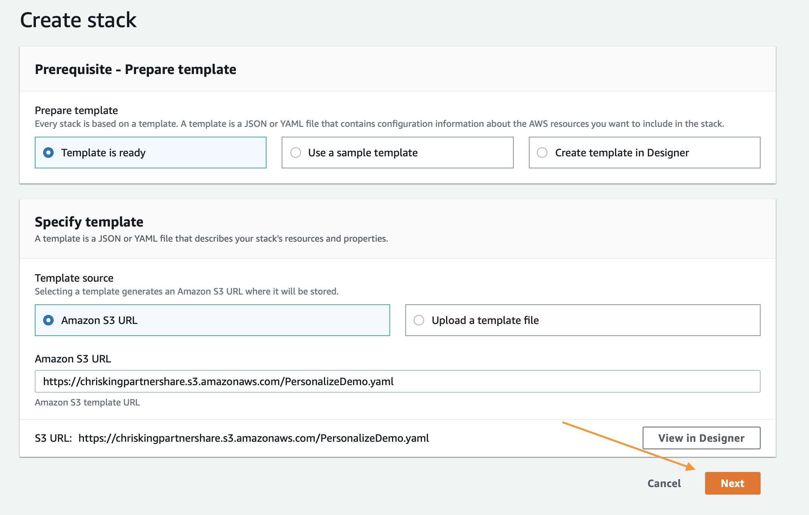
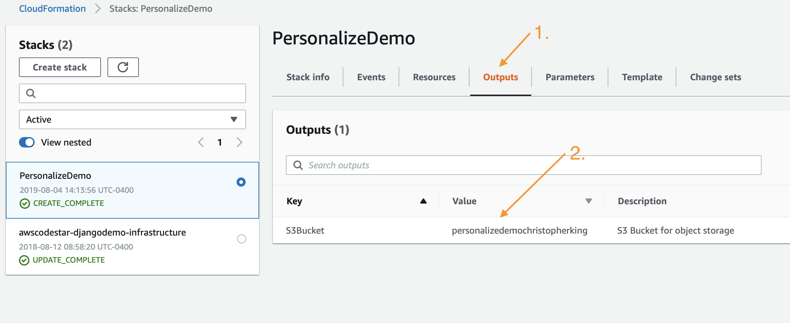
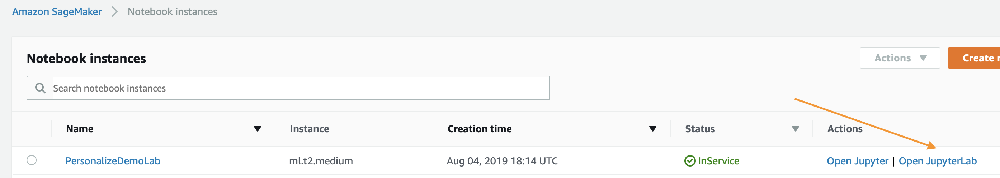

# Amazon Personalize Samples

This repository contains a collection of notebooks and examples to help you learn how to utilize Amazon Personalize. It begins with a CloudFormation template that deploys an S3 bucket, IAM Role, and SageMaker Notebook instance in order to execute the demos and to act as a getting started guide for a POC.

## Prerequisites

Only applies if you are deploying with the CloudFormation template below, otherwise consult the IAM permissions needed for your specific task.

1. AWS Account
2. User with administrator access to the AWS Account

## Process

1. First you will deploy a CloudFormation template that will do the following:
    1. Create an S3 bucket for all of your data storage.
    1. Create a SageMaker Notebook Instance for you to complete the workshop.
    1. Create the IAM policies needed for your notebook.
    1. Clone this repository into the notebook so you are ready to work.
1. Open the notebook and follow the instructions below.

In this workshop you will build your very own recommendation model that will recommend movies to users based on their past preferences. You will further improve the recommendation model to take into account a user's interactions with movie items to provide accurate recommendations.  This workshop will use the publicly available movie lens dataset.

## FAQs

See [FAQs.md](FAQs.md)

## Building Your Environment

As mentioned above, the first step is to deploy a CloudFormation template that will perform much of the initial setup for you. In another browser window login to your AWS account. Once you have done that open the link below in a new tab to start the process of deploying the items you need via CloudFormation.

Follow along with the screenshots if you have any questions about these steps.

### Cloud Formation Wizard

Start by clicking `Next` at the bottom like shown:

In the next page you need to provide a unique S3 bucket name for your file storage, it is recommended to simply add your first name and last name to the end of the default option as shown below, after that update click `Next` again.

This page is a bit longer so scroll to the bottom to click `Next`.

Again scroll to the bottom, check the box to enable the template to create new IAM resources and then click `Create Stack`.

For a few minutes CloudFormation will be creating the resources described above on your behalf it will look like this while it is provisioning:

Once it has completed you'll see green text like below indicating that the work has been completed:

Now that you have your environment created, you need to save the name of your S3 bucket for future use, you can find it by clicking on the `Outputs` tab and then looking for the resource `S3Bucket`, once you find it copy and paste it to a text file for the time being.

## Agenda

The steps below outline the process of building your own recommendation model, improving it, and then cleaning up all of your resources to prevent any unwanted charges. To get started executing these follow the steps in the next section.

1. `Personalize_BuildCampaign.ipynb`  - Guides you through building your first campaign and recommendation algorithm. 
2. `View_Campaign_And_Interactions.ipynb` - Showcase how to generate a recommendation and how to modify it with real time intent. 
3. `Cleanup.ipynb` - Deletes anything that was created so you are not charged for additional resources.

## Using the Notebooks

Start by navigating to the SageMaker serivce page by clicking the `Services` link in the top navigation bar of the AWS console.

In the search field enter `SageMaker` and then click for the service when it appears, from the service page click the `Notebook Instances` link on the far left menu bar.

To get to the Jupyter interface, simply click `Open JupyterLab` on the far right next to your notebook instance.

Clicking the open link will take a few seconds to redirect you to the Jupyter system but once there you should see a collection of files on your left. Get started by clicking on `Personalize_BuildCampaign.ipynb`.

The rest of the lab will take place via the Jupyter notebooks, simply read each block before executing it and moving onto the next. If you have any questions about how to use the notebooks please ask your instructor or if you are working independently this is a pretty good video to get started:

https://www.youtube.com/watch?v=Gzun8PpyBCo

## After the Notebooks

Once you have completed all of the work in the Notebooks and have completed the cleanup steps there as well, the last thing to do is to delete the stack you created with CloudFormation. To do that, inside the AWS Console again click the `Services` link at the top, and this time enter in `CloudFormation` and click the link for it.

Click the `Delete` button on the demo stack you created:

Lastly click the `Delete Stack` button that shows up on the popup:

You'll now notice that the stack is in progress of being deleted. Once you see `Delete Completed` you know that everything has been deleted and you are 100% done with this lab.

## License Summary

This sample code is made available under a modified MIT license. See the LICENSE file.