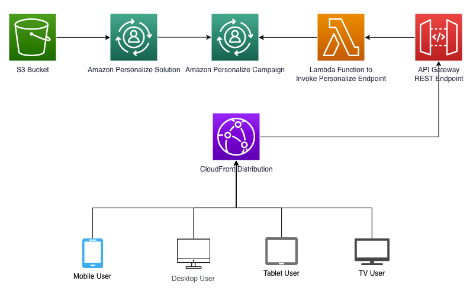

## Amazon Personalize - Automatic Context

### Overview:

This is a companion code repository to an AWS blog post on setting automatic user context of device type and dynamic filters on user's country in Amazon Personalize (ADD LINK LATER). In the blog, we discuss the benefits of setting user context like device type, time of day and location automatically with illustrations on how easily it can be setup. In this repository, we provide artifacts that demonstrate the ability of Amazon Personalize APIs to provide customized recommendations based on user's device type derived automatically.

### Architecture

Here is a diagram showing the solution architecture:

### Prerequisites

Prior to running the steps under Instructions, you will need access to an AWS Account where you have full Admin privileges. The CloudFormation template will deploy multiple AWS Lambda functions, IAM Roles, and a new SageMaker Studio domain. In addition, having basic knowledge of the following services will be valuable: AWS Lambda, Amazon CloudFront, and Amazon IAM Roles.

### Instructions

1. Click 'Launch Stack' for the AWS region you want to deploy resources into

|AWS Region                |     Link        |
|:------------------------|:-----------:|
|us-east-1 (N. Virgnia)    |  |
|us-east-2 (Ohio)    |  |
|us-west-1 (N. California)    |  |
|eu-west-1 (Dublin)    |  |
|ap-northeast-1 (Tokyo)    |  |

To deploy the stack in other regions, you can [follow these instructions](./create_stack_in_other_regions.md). Please log an issue in this repo if you would like additional regions officially supported.
1. Click 'Next' for 'Specify template', 'Specify stack details', and 'Configure stack options'. On the 'Review' step, check the box that says 'I acknowledge that AWS CloudFormation might create IAM resources with custom names.' and then click 'Create Stack'. You can view the CloudFormation template directly by looking [here](./templates/personalize-auto-context-template.yml). The stack will take a few minutes to launch. When it completes, you can view the items created by clicking on the Resources tab. 
2. Once the stack is complete, browse to Amazon SageMaker in the AWS console and click on the 'Domains' tab on the left. 
3. Click on the pre-created SageMaker domain and launch SageMaker Studio. 
4. Inside SageMaker Studio's top menu, choose “Git” and choose “Clone a Repository” from the sub-menu. ACTUAL LOCATION TO BE KEYED IN LATER.

### Running the Notebooks

There are a series of notebooks which should be run in order. Follow the step-by-step guide in each notebook:

* [notebooks/1.Building_Personalize_Campaign.ipynb](./notebooks/1.Building_Personalize_Campaign.ipynb) - generate synthetic dataset and host a Personalize campaign based off of it.
* [notebooks/2.Passing_Context_Automatically.ipynb](./notebooks/2.Passing_Context_Automatically.ipynb) - Test context setting happening automatically using resources pre-created by CloudFormation template.
* [notebooks/3.Cleanup.ipynb](./notebooks/3.Cleanup.ipynb) - Cleanup resources.

### Things to be aware of - IMPORTANT

- In SageMaker Studio notebooks, the "Run All Cells" option is not recommended as there are important manual intervening steps that are essential for successful completion of the workshop.
- Recommend setting Image: Data Science; Kernel: Python3 and Instance type: ml.t3.medium (2 vCPU + 4 GiB). Prefer instance sizes with larger memory if there are any out of memory situations from Pandas library calls.

### Clean up - IMPORTANT
To destroy the AWS resources created as part of this example, complete the following two steps:
1. Run all cells in [notebooks/3.Cleanup.ipynb](./notebooks/3.Cleanup.ipynb) 
2. Go to CloudFormation in the AWS console, select `personalize-auto-context-stack` and click 'Delete'.
3. Explicitly delete the SageMaker created EFS volume, its security groups and Elastic Network Interfaces.

## Security

See [CONTRIBUTING](CONTRIBUTING.md#security-issue-notifications) for more information.

## License

This library is licensed under the MIT-0 License. See the [LICENSE](./LICENSE) file.