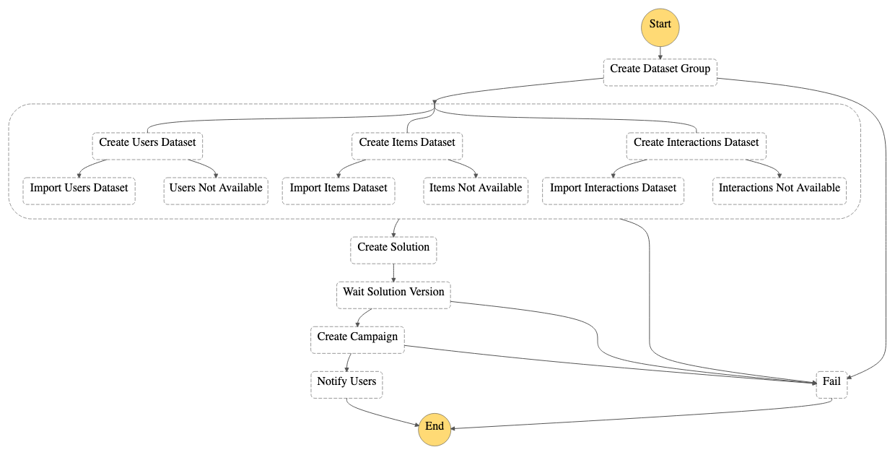

**This example has been replaced by the AWS Solution [Maintaining Personalized Experiences with Machine Learning](https://aws.amazon.com/solutions/implementations/maintaining-personalized-experiences-with-ml/). This Solution allows you to automate the end-to-end process of importing datasets, creating solutions and solution versions, creating and updating campaigns, creating filters, and running batch inference jobs. These processes can be run on-demand or triggered based on a schedule that you define.**

# Getting Started

ML Ops is gaining a lot of popularity. This example showcases a key piece you can use to construct your automation pipeline. As we can see in the following architecture diagram, you will be deploying an AWS Step Function Workflow containing AWS Lambda functions that call Amazon S3, Amazon Personalize, and Amazon SNS APIs.

This package contains the source code of a Step Functions pipeline that is able to perform
multiple actions within **Amazon Personalize**, including the following:

- Dataset Group creation
- Datasets creation and import
- Solution creation
- Solution version creation
- Campaign creation

Once the steps are completed, the step functions notifies the users of its completion through the
use of an SNS topic.

The below diagram describes the architecture of the solution:


The below diagram showcases the StepFunction workflow definition:



## Prerequisites

### Installing AWS SAM

The AWS Serverless Application Model (SAM) is an open-source framework for building serverless applications. It provides shorthand syntax to express functions, APIs, databases, and event source mappings. With just a few lines per resource, you can define the application you want and model it using YAML. During deployment, SAM transforms and expands the SAM syntax into AWS CloudFormation syntax, enabling you to build serverless applications faster.

**Install** the [AWS SAM CLI](https://docs.aws.amazon.com/serverless-application-model/latest/developerguide/serverless-sam-cli-install.html).
This will install the necessary tools to build, deploy, and locally test your project. In this particular example we will be using AWS SAM to build and deploy only. For additional information please visit our [documentation](https://docs.aws.amazon.com/serverless-application-model/latest/developerguide/what-is-sam.html).

## Build and Deploy

In order to deploy the project you will need to run the following commands:

1. Clone the Amazon Personalize Samples repo
    - `git clone https://github.com/aws-samples/amazon-personalize-samples.git`
2. Navigate into the *next_steps/operations/ml_ops/personalize-step-functions* directory
    - `cd next_steps/operations/ml_ops/personalize-step-functions`
3. Build your SAM project. [Installation instructions](https://docs.aws.amazon.com/serverless-application-model/latest/developerguide/serverless-sam-cli-install.html)
    - `sam build`
4. Deploy your project. SAM offers a guided deployment option, note that you will need to provide your email address as a parameter to receive a notification.
    - `sam deploy --guided`
5. Navigate to your email inbox and confirm your subscription to the SNS topic

The pipeline will query you for an email and a default name for the parameter file.

Once deployed, the solution will create the **InputBucket** which you can find in the CloudFormation stack output. Use it to upload your datasets
using the following structure:

```bash
Users/              # Users dataset(s) folder
Items/              # Items dataset(s) folder
Interactions/       # Interaction dataset(s) folder
```

After your datasets are submitted, upload the parameters file in **the root directory**. This step
 will start the step functions workflow.

## Configuration

To use this deployment you will need to properly setup a **parameter file**. The parameter file
contains all the necessary information to create the resources on Amazon Personalize. It fetches
the parameters using the [boto3 personalize client](https://boto3.amazonaws.com/v1/documentation/api/latest/reference/services/personalize.html).

The file should include the following sections, **all mandatory**:
- `datasetGroup`
- `datasets`
- `solution`
- `campaign`

<details><summary>See a sample of the parameter file</summary>
<p>

```json
{
    "datasetGroup": {
        "name":"DatasetGroup"
    },
    "datasets": {
        "Interactions": {
            "name":"InteractionsDataset",
            "schema": {
              "type": "record",
              "name": "Interactions",
              "namespace": "com.amazonaws.personalize.schema",
              "fields": [
                {
                  "name": "USER_ID",
                  "type": "string"
                },
                {
                  "name": "ITEM_ID",
                  "type": "string"
                },
                {
                  "name": "TIMESTAMP",
                  "type": "long"
                }
              ],
              "version": "1.0"
            }
        },
        "Users": {
            "name": "UsersDataset",
                "schema": {
                "type": "record",
                "name": "Users",
                "namespace": "com.amazonaws.personalize.schema",
                "fields": [
                    {
                        "name": "USER_ID",
                        "type": "string"
                    },
                    {
                        "name": "GENDER",
                        "type": "string",
                        "categorical": true
                    },
                    {
                        "name": "AGE",
                        "type": "int"
                    }
                ],
                "version": "1.0"
            }
        }
    },
    "solution": {
        "name": "Solution",
        "performAutoML": true
    },
    "campaign": {
        "name": "Campaign",
        "minProvisionedTPS": 1
    }
}
```
</p>
</details>

### Parameters file structure

To view how to create your parameter file, visit [this example](./example/params.json).
Each section corresponds to an API call.

### How to define a schema

https://docs.aws.amazon.com/personalize/latest/dg/how-it-works-dataset-schema.html


## Testing Example

In order to test the deployment please run the following command **inside the ml_ops folder**:


```bash
aws s3 sync ./example/data s3://{YOURBUCKETNAME}

aws s3 cp ./example/params.json s3://{YOURBUCKETNAME}
```

This will start the execution of the Step Functions workflow. To follow the execution navigate
to the Step Functions section of the AWS Console and click on the **DeployStateMachine-xxx** state
machine.

> You will need to specify the correct S3 bucket name created before. The state machine
starts when the parameter file is submitted to the S3 bucket.

## Next Steps

Congratulations! You have successfully trained a Personalize model and created a Campaign. You can get recommendations leveraging your campaign ARN or by visiting the [Amazon Personalize Console](https://console.aws.amazon.com/personalize/home?region=us-east-1#datasetGroups) Dataset Group Campaign section.

For additional information on Getting Recommendations please visit our [documentation](https://docs.aws.amazon.com/personalize/latest/dg/getting-recommendations.html) or one of our walkthrough [notebook examples](https://github.com/aws-samples/amazon-personalize-samples/blob/master/personalize_sample_notebook.ipynb).
