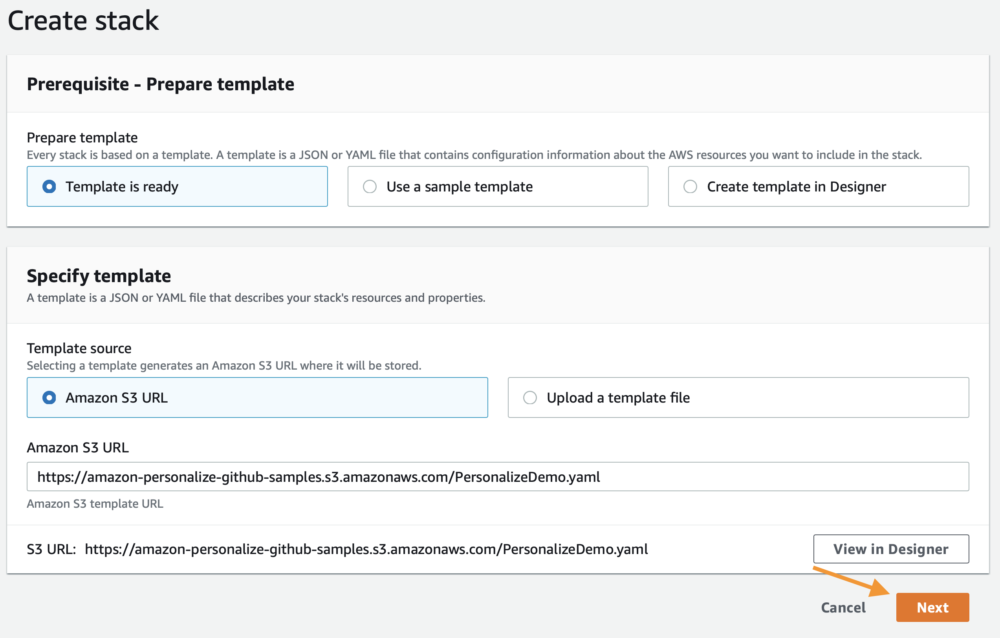
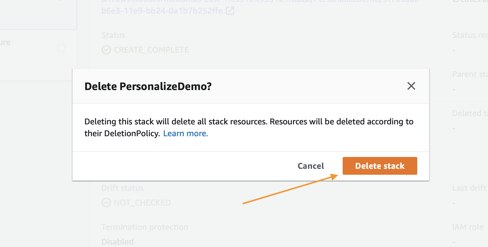

# Introducción

Este tutorial lo guiará para comenzar a utilizar Amazon Personalize:

1. Creación de un entorno de trabajo (vea los pasos a continuación)
2. Cree los primeros recomendadores optimizados para casos de uso para video bajo demanda y comercio electrónico.
3. Cree su primer conjunto de datos personalizado, modelo y campaña de recomendación.

## Requisitos previos del entorno

Estos requisitos solo se tienen en cuenta si implementa desde la plantilla de CloudFormation. De lo contrario, consulte los permisos de IAM necesarios para su tarea específica.

1. Cuenta de AWS
2. Usuario con acceso de administrador a la cuenta de AWS

## Creación de su entorno

El primer paso es implementar una plantilla de CloudFormation que realizará gran parte del trabajo de configuración inicial por usted. Inicie sesión en su cuenta de AWS en otra ventana del navegador. Cuando ingrese a su cuenta, abra el enlace que aparece debajo en una nueva pestaña para comenzar el proceso de implementación de los elementos que necesita mediante CloudFormation.

Siga las instrucciones en las capturas de pantalla si tiene alguna pregunta acerca de estos pasos.

  
Haga clic para ampliar las instrucciones.

  
### Haga clic en Next (Siguiente), al final de la página, para abrir el WizardStart de CloudFormation:

En la página siguiente, deberá proveer un nombre único para un bucket de S3 para el almacenamiento de archivos. Se recomienda agregar su nombre y apellido al final de la opción predeterminada, como se muestra debajo. Al finalizar, haga clic en `Next` (Siguiente) de nuevo.

Esta página es más extensa, deslícese hasta el final y haga clic en `Next` (Siguiente).

Deslícese otra vez hasta el final, compruebe la casilla para permitir a la plantilla la creación de recursos nuevos de IAM y luego haga clic en `Create Stack` (Crear pila).

CloudFormation tardará unos minutos en crear los recursos descritos arriba. Para su beneficio, se verá de esta manera mientras está aprovisionando:

Una vez completo, verá texto en verde, como el que aparece abajo, que indica que el trabajo se completó:

Ahora que ha creado el entorno, necesita guardar el nombre de su bucket de S3 para uso futuro. Para buscar el nombre, haga clic en la pestaña `Outputs` (Salidas) y, luego, busque el recurso `S3Bucket` (Bucket de S3). Cuando lo encuentre, cópielo y péguelo, de momento, en un archivo de texto.

## Uso de los cuadernos

Primero, navegue hasta la [página](https://console.aws.amazon.com/sagemaker/home) de aterrizaje de Amazon SageMaker. Desde la página de servicio, haga clic en el enlace `Notebook Instances` (Instancias de cuadernos) en la barra de menú de la izquierda.

Para acceder a la interfaz de Jupyter, simplemente haga clic en `Open JupyterLab` (Abrir JupyterLab) en el extremo derecho junto a su instancia de cuaderno.

El enlace tardará unos segundos en redirigirlo al sistema Jupyter. Una vez allí, debería ver una colección de archivos a la izquierda.

Para iniciar, navegue al primer cuaderno mediante [grupos de conjunto de datos de dominio y recomendadores optimizados para casos de uso](https://docs.aws.amazon.com/personalize/latest/dg/create-domain-dataset-group.html).

`amazon-personalize-samples/getting_started/notebooks/Building_Your_First_Recommender_Video_On_Demand.ipynb`

`amazon-personalize-samples/getting_started/notebooks/Building_Your_First_Recommender_Ecommerce.ipynb`

O bien, mediante [grupos de conjunto de datos personalizados](https://docs.aws.amazon.com/personalize/latest/dg/custom-dataset-groups.html):

`amazon-personalize-samples/getting_started/notebooks/1.Building_Your_First_Campaign.ipynb`

El resto del laboratorio tendrá lugar en los cuadernos de Jupyter, solo lea cada bloque antes de ejecutarlo y continuar con el siguiente. Si tiene preguntas sobre cómo utilizar los cuadernos, pregunte a su instructor o, si está trabajando de forma independiente, puede mirar este video para dar los primeros pasos:

https://www.youtube.com/watch?v=Gzun8PpyBCo

## Después de los cuadernos

Una vez que haya completado todo el trabajo en los cuadernos, así como también los pasos de limpieza que aparecen allí, lo último que queda por hacer es eliminar la pila que creó con CloudFormation. Para hacer eso, dentro de la consola de AWS, haga clic en el enlace `Services` (Servicios), que aparece al principio, ingrese en `CloudFormation` y haga clic en enlace para este.

Haga clic en el botón `Delete` (Eliminar) en la pila de demostración que creó:

Por último, haga clic en el botón `Delete Stack` (Eliminar pila) que aparece en el mensaje emergente:

Ahora, notará que la pila se encuentra en proceso de eliminación. Cuando vea el mensaje `Delete Completed` (Eliminación completa) sabrá que se borró todo y que terminó este laboratorio por completo.

