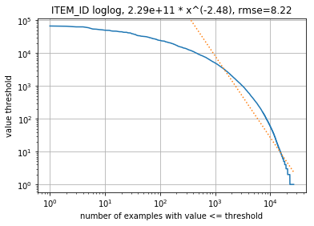
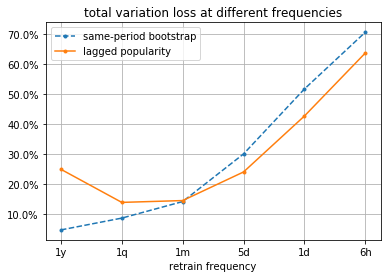

Diagnóstico/herramientas de visualización de datos
===
Utilice [diagnose.py](diagnose.py) para sondear el conjunto de datos por cualquier problema obvio, como la falta de características de datos o elementos.
Puede encontrar algunos ejemplos sobre cómo utilizar diagnose.py en [example_ml_100k.ipynb](example_ml_100k.ipynb), [example_ml_1m.ipynb](example_ml_1m.ipynb) y [example_ml_20m.ipynb](example_ml_20m.ipynb).

Explicaremos algunos resultados de ejemplo desde la tabla de interacciones. La herramienta también examina las tablas de elementos y usuarios de maneras similares.

Tabla de interacciones, forma original = (20000263, 4)
---

Primero, buscamos datos faltantes o duplicados en la tabla de interacciones. Esperamos una gran cantidad de interacciones y datos faltantes insignificantes (<10 %) en todos los campos. El sistema descarta los duplicados en (USER_ID, ITEM_ID, TIMESTAMP).
```
missing rate in fields ['USER_ID', 'ITEM_ID', 'TIMESTAMP'] 0.0
dropna shape (20000263, 4)
duplication rate 0.0
drop_duplicates shape (20000263, 4)
```
También, buscamos actividades de usuario y elemento repetidas a lo largo de los historiales de los usuarios. Las tasas de repetición altas (>50 %) indican, en general, historiales de usuario extensos y puede resultar beneficioso considerar mantener solo las últimas interacciones (descartar las demás) o utilizar modelos jerárquicos (TODO).
```
user item repeat rate 0.0
```

Descripción de la tabla de interacciones
---

Para cada columna de datos, informamos una descripción de las estadísticas clave.
En el caso de las variables numéricas, la independencia/diversidad suficiente es, en general, una buena señal de que la variable puede ser un factor de causa que podremos utilizar en el modelo, en lugar de un factor de efecto que es menos informativo en cuanto a nuestras tareas de aprendizaje.

En el caso de las columnas categóricas, como ITEM_ID, también ajustamos una función de ley potencial en la distribución de conteo de las categorías únicas.
Establecemos límites de conteo para el número de categorías que tienen valores mayores o iguales a los límites.
Una línea derecha en la representación logarítmica implica que un cambio relativo en el límite debería resultar en un cambio relativo proporcional en el número de categorías que supere el límite.



Ajustamos el coeficiente de proporción, en este caso, -2,48, y el error cuadrático medio (RMSE) para el ajuste en el espacio logarítmico.
El coeficiente debe ser negativo.

   Un coeficiente de gran magnitud (<-2) indica que la distribución es de cabeza pesada, es decir, que las actividades se inclinan hacia muy pocas categorías.
   En este caso, deberíamos enfocarnos en la cobertura de las categorías. Por ejemplo, el conteo de ITEM_ID puede estar inclinado hacia pocas categorías cuando el sistema existente tiene un diseño sin personalizar y los usuarios hacen clic en las categorías principales predispuestos por la ubicación.
   Incluir contextos posicionales en los modelos puede diversificar los resultados, lo que resulta en una mejor personalización.

   Un coeficiente de pequeña magnitud (>-0,5) implica una distribución de cola pesada, esto es, que los conteos son bastante uniformes.
   Una distribución de ITEM_ID uniforme puede ser, todavía, un buen caso porque no se considera la correlación entre las actividades.
   Podemos esperar que a través de la recomendación basada en el usuario/elemento, los elementos anteriores reduzcan la cantidad de ITEM_ID para recomendar en el futuro.

Todas estas correcciones mediante personalización pueden funcionar hasta un límite.
Compartimos guías de advertencia para indicar un estimado muy general de los límites de la capacidad de modelado.
Podrían ser erróneas en un caso de uso específico. Proceda con precaución.

Análisis de cambio temporal
---

La recomendación sucede en un mundo dinámico, donde el contenido nuevo se crea con rapidez y el contenido viejo queda desactualizado.
Esto crea dos desafíos: el recomendador debe volver a entrenarse con nueva información de forma frecuente y debe aplicar un límite duro o volver a pesar ejemplos anteriores con recency_mask.

El siguiente análisis de frecuencia de nuevo entrenamiento tiene como objetivo predecir la distribución de popularidad de los elementos marginales en cada periodo mediante la popularidad de arranque del mismo periodo y la popularidad del último periodo, respectivamente.
Cada punto de datos es el promedio ponderado de todos los periodos en la frecuencia especificada.
Cuando la popularidad rezagada causa una pérdida mayor significativa que el arranque del mismo periodo, se debería llevar a cabo un nuevo entrenamiento.
En esta representación, la frecuencia óptima de entrenamiento nuevo es de, al menos, una vez al mes (MovieLens es un conjunto de datos de encuesta, por lo que el contenido fluye lentamente).



De forma similar, el siguiente análisis de cambio temporal predice la distribución de elementos marginales en los próximos periodos mediante el historial continuo de X periodos anteriores.
El análisis calcula los promedios ponderados por densidad de actividad, pero solo presenta los últimos 100 puntos para que sea más claro.
La configuración óptima debería establecerse como el límite duro de los datos históricos o como la vida media de la ponderación de los datos recientes (TODO).
En el ejemplo, la retención óptima del historial es de los últimos 50 días.
Sin embargo, las soluciones de Personalize tienen recency_mask incorporado y, en caso de dudas, es beneficioso retener historiales de usuario más extensos.


La pérdida principal que consideraremos es la pérdida de variación total (TV), aunque también se incluye el porcentaje de pérdida de tráfico debido a elementos fuera de la muestra, lo que explica de forma parcial una pérdida de TV grande.
Los clientes con grandes pérdidas debido a elementos fuera de la muestra, deberían considerar la [receta de COLD-START](../personalize_temporal_holdout/personalize_coldstart_demo.ipynb).


Descripción del delta del tiempo para sesiones
---

En el caso de los usuarios con historiales extensos, suele resultar útil agrupar historiales de usuarios en sesiones cortas, dentro de cada una de las cuales los usuarios tienden a mantener intereses similares.
Utilizamos el delta del tiempo para decidir las señales del inicio de sesión (BoS).
Nuestro trabajo de investigación [1] muestra que estas señales mejoran la calidad de las recomendaciones de manera significativa.
El siguiente gráfico muestra la distribución de la ley potencial del delta del tiempo entre todos lo pares de actividades adyacentes.


Desde el gráfico, podemos interpretar que menos del 10 % de todos los deltas del tiempo tienen intervalos de más de 1 minuto y menos del 1 % tienen intervalos de más de 1 mes.
Si establecemos el límite de sesión a 1 minuto, nos queda el 10 % de las señales de BoS en el nivel entre sesiones.
La combinación con el gráfico de ley potencial de USER_ID nos indica que los usuarios tienen un promedio de 10 sesiones en sus historiales de actividad.

Como comentario adicional, el conjunto de datos de MovieLens tiene un límite de sesión bastante corto porque es de un sitio web de encuestas sobre películas.
En general, otros tipos de conjuntos de datos tienen límites de BoS más extensos, donde podemos definir, de forma adicional, jerarquías de sesiones múltiples (TODO).

#### Referencias
[1] Yifei Ma, Balakrishnan (Murali) Narayanaswamy. Hierarchical Temporal-Contextual Recommenders (Recomendadores jerárquicos temporales-contextuales). NIPS 2018 Workshop on Modeling and Decision-Making in Spatiotemporal Domains (Taller de modelado y toma de decisiones en dominios espaciotemporales.) [enlace](https://openreview.net/forum?id=ByzxsrrkJ4)
