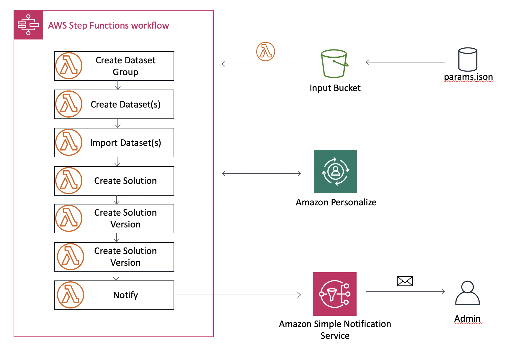
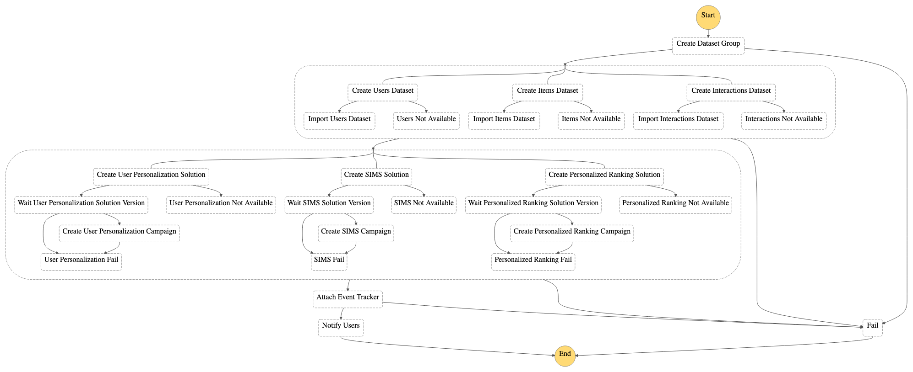

**Este ejemplo se reemplazó por la solución [Mantenimiento de las experiencias personalizadas con machine learning](https://aws.amazon.com/solutions/implementations/maintaining-personalized-experiences-with-ml/) de AWS. Esta solución permite automatizar el proceso completo de importar conjuntos de datos, crear soluciones y versiones de soluciones, crear y actualizar campañas, crear filtros y ejecutar trabajos de inferencia por lotes. Estos procesos pueden ejecutarse bajo demanda o activarse en función de un programa que se defina.**

# Introducción

La popularidad de ML Ops aumenta. Este ejemplo muestra una pieza clave para construir su canalización de automatización. Como se puede observar en el siguiente diagrama de arquitectura, implementará un flujo de trabajo de AWS Step Functions que contiene funciones de Lambda que llaman a Amazon S3, a Amazon Personalize y a las API de Amazon SNS.

Este paquete contiene el código fuente de una canalización de Step Functions que es capaz de desarrollar acciones múltiples
dentro de **Amazon Personalize** y que incluye lo siguiente:

- Creación de un grupo de conjunto de datos
- Creación e importación de conjuntos de datos
- Creación de soluciones
- Creación de versiones de solución
- Creación de una campaña

Una vez completos los pasos, Step Functions notifica a los usuarios de la finalización a través de
un tema de SNS.

El siguiente diagrama describe la arquitectura de la solución:



El siguiente diagrama muestra la definición del flujo de trabajo de Step Function:



## Requisitos previos

### Instalación de AWS SAM

El Modelo de aplicación sin servidor (SAM) de AWS es un marco de trabajo de código abierto para la creación de aplicaciones sin servidor. Proporciona la sintaxis abreviada para expresar las funciones, las API, las bases de datos y el mapeo del origen de los eventos. Con solo unas pocas líneas por recurso, puede definir la aplicación que desea y modelarla mediante YAML. Durante la implementación, el SAM transforma y expande la sintaxis SAM a la sintaxis de AWS CloudFormation, lo que permite crear aplicaciones sin servidor de forma más rápida.

**Instale** la [CLI de AWS SAM](https://docs.aws.amazon.com/serverless-application-model/latest/developerguide/serverless-sam-cli-install.html).
Esto instalará las herramientas necesarias para crear su proyecto, implementarlo y probarlo de manera local. En este ejemplo en particular, solo utilizaremos AWS SAM para crear e implementar. Para obtener más información, consulte nuestra [documentación](https://docs.aws.amazon.com/serverless-application-model/latest/developerguide/what-is-sam.html).

## Creación e implementación

Para implementar el proyecto, necesitará ejecutar los siguientes comandos:

1. Clone el repositorio de Amazon Personalize Samples
    - `git clone https://github.com/aws-samples/amazon-personalize-samples.git`
2. Navegue al directorio *next_steps/operations/ml_ops/personalize-step-functions*
    - `cd next_steps/operations/ml_ops/personalize-step-functions`
3. Cree su proyecto de SAM. [Instrucciones de instalación](https://docs.aws.amazon.com/serverless-application-model/latest/developerguide/serverless-sam-cli-install.html)
    - `sam build`
4. Implemente su proyecto. El SAM ofrece una opción de implementación guiada, tenga en cuenta que necesitará proveer su dirección de email como parámetro para recibir una notificación.
    - `sam deploy --guided`
5. Navegue a la bandeja de entrada de su email y confirme la subscripción al tema de SNS

La canalización requerirá una dirección de email y un nombre predeterminado para el archivo de parámetro.

Una vez implementada, la solución creará **InputBucket**, que podrá encontrar en los resultados de la pila de CloudFormation. Utilícelo para cargar los conjuntos de datos
mediante la siguiente estructura:

```bash
Users/              # Users dataset(s) folder
Items/              # Items dataset(s) folder
Interactions/       # Interaction dataset(s) folder
```

Después de enviar los conjuntos de datos, cargue el archivo de parámetros en **el directorio raíz**. Este paso
 iniciará el flujo de trabajo de Step Functions.

## Configuración

Para utilizar esta implementación, necesita configurar de forma apropiada un **archivo de parámetro**. El archivo de parámetro
contiene toda la información necesaria para la creación de recursos en Amazon Personalize. Busca
los parámetros mediante el [cliente de Personalize de boto3](https://boto3.amazonaws.com/v1/documentation/api/latest/reference/services/personalize.html).

El archivo debe incluir las secciones que se detallan. **Todas son obligatorias**:
- `datasetGroup`
- `datasets`
- `solution`
- `campaign`

<details><summary>Vea un ejemplo del archivo de parámetro</summary>
<p>

```json
{
    "datasetGroup": {
        "name":"DatasetGroup"
    },
    "datasets": {
        "Interactions": {
            "name":"InteractionsDataset",
            "schema": {
              "type": "record",
              "name": "Interactions",
              "namespace": "com.amazonaws.personalize.schema",
              "fields": [
                {
                  "name": "USER_ID",
                  "type": "string"
                },
                {
                  "name": "ITEM_ID",
                  "type": "string"
                },
                {
                  "name": "TIMESTAMP",
                  "type": "long"
                }
              ],
              "version": "1.0"
            }
        },
        "Users": {
            "name": "UsersDataset",
                "schema": {
                "type": "record",
                "name": "Users",
                "namespace": "com.amazonaws.personalize.schema",
                "fields": [
                    {
                        "name": "USER_ID",
                        "type": "string"
                    },
                    {
                        "name": "GENDER",
                        "type": "string",
                        "categorical": true
                    },
                    {
                        "name": "AGE",
                        "type": "int"
                    }
                ],
                "version": "1.0"
            }
        }
    },
    "solution": {
        "name": "Solution",
        "performAutoML": true
    },
    "campaign": {
        "name": "Campaign",
        "minProvisionedTPS": 1
    }
}
```
</p>
</details>

### Estructura del archivo de parámetros

Para obtener más información sobre la creación del archivo de parámetros, consulte [este ejemplo](./example/params.json).
Cada sección corresponde a una llamada de la API.

### Cómo definir un esquema

https://docs.aws.amazon.com/personalize/latest/dg/how-it-works-dataset-schema.html


## Ejemplo de prueba

Para probar la implementación, ejecute el siguiente comando **dentro de la carpeta ml_ops**:


```bash
aws s3 sync ./example/data s3://{YOURBUCKETNAME}

aws s3 cp ./example/params.json s3://{YOURBUCKETNAME}
```

Este paso iniciará la ejecución del flujo de trabajo de Step Functions. Para supervisar la ejecución, navegue
a la sección de Step Functions de la consola de AWS y haga clic en la máquina
de estado **DeployStateMachine-xxx**.

> Deberá especificar el nombre del bucket de S3 correcto que creó antes. La máquina de estado
> inicia cuando el archivo de parámetro se carga en el bucket de S3.

## Próximos pasos

¡Felicitaciones! Entrenó un modelo de Personalize y creó una campaña de forma exitosa. Puede obtener recomendaciones mediante el ARN de su campaña o en la sección campaña de grupo de conjunto de datos en la [Consola de Amazon Personalize](https://console.aws.amazon.com/personalize/home?region=us-east-1#datasetGroups).

Para obtener más información sobre la obtención de recomendaciones, consulte nuestra [documentación](https://docs.aws.amazon.com/personalize/latest/dg/getting-recommendations.html) o uno de nuestros tutoriales de [ejemplos de cuadernos](https://github.com/aws-samples/amazon-personalize-samples/blob/master/personalize_sample_notebook.ipynb).
