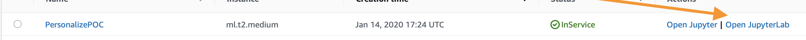

## Día de inmersión de Amazon Personalize

La meta de este día de inmersión es brindar un punto de partida en común para aprender a utilizar las diferentes características de [Amazon Personalize](https://aws.amazon.com/personalize/).

Para obtener especificaciones detalladas de cualquier concepto mencionado, consulte la [Guía para desarrolladores de Personalize](https://docs.aws.amazon.com/personalize/latest/dg/what-is-personalize.html)

En los cuadernos aprenderá lo siguiente:

1. Preparar un conjunto de datos para utilizarlo con Amazon Personalize.
1. Crear modelos basados en ese conjunto de datos.
1. Evaluar el rendimiento de un modelo basado en observaciones reales.

## Programa

Los pasos que se detallan a continuación detallan el proceso para crear sus propios modelos de predicción de serie temporal, evaluar dichos modelos y, luego, limpiar todos los recursos para prevenir cargos indeseados. Para comenzar, realice los siguientes pasos.

1. Implemente la plantilla de CloudFormation que aparece debajo o cree un entorno de Jupyter local con la AWS CLI instalada y configurada para su cuenta de IAM.
1. El archivo [personalize_hrnn_metadata_contextual_example.ipynb](personalize_hrnn_metadata_contextual_example.ipynb) muestra cómo esta información útil puede subirse a nuestro sistema para ayudar las recomendaciones. Tenga en cuenta que las mejoras en las recetas de metadatos dependen de cuánta información pueda extraerse desde los metadatos provistos.

## Requisitos previos 

1. Una cuenta de AWS
1. Un usuario en dicha cuenta con privilegios de administrador

## Esquema

1. En primer lugar, implementará una plantilla de CloudFormation que creará un bucket de S3 para el almacenamiento de datos, una instancia de cuaderno de SageMaker donde se ejecutarán los ejercicios, políticas de IAM para la instancia del cuaderno y clonará este repositorio en la instancia del cuaderno para estar listo para comenzar.
1. A continuación, abra el archivo `personalize_hrnn_metadata_contextual_example.ipynb` para comenzar.
1. Este cuaderno lo guiará por el proceso de los otros cuadernos hasta que Amazon Personalize esté evaluado y en funcionamiento.

## Creación de su entorno:

Como se mencionó anteriormente, el primer paso es implementar una plantilla de CloudFormation que se encargará de la mayor parte de la configuración inicial. Inicie sesión en su cuenta de AWS en otra ventana o pestaña del navegador. Cuando ingrese a su cuenta, abra el enlace que aparece debajo en una nueva pestaña para comenzar el proceso de implementación de los elementos que necesita mediante CloudFormation.

Siga las instrucciones en las capturas de pantalla si tiene alguna pregunta sobre la implementación de la pila.

### Asistente de CloudFormation

Haga clic en `Next` (Siguiente), al final, de esta manera:

En esta página deberá llevar a cabo algunas tareas:

1. Cambie el nombre de la pila por uno relevante, como `PersonalizeImmersionDay`
1. Cambiar el nombre del cuaderno (opcional)
1. Modifique el tamaño del volumen para el volumen de EBS de SageMaker. De forma predeterminada, tiene 10 GB, si su conjunto de datos es mayor, aumente el volumen de acuerdo con esa medida.

Cuando termine, haga clic en `Next` (Siguiente) al final.

Esta página es un poco más larga, deslícese hasta el final y haga clic en `Next` (Siguiente). La configuración predeterminada debería ser suficiente para completar la POC. Si necesita requerimientos personalizados, modifique lo que sea necesario.

Deslícese hasta final otra vez, marque la casilla para permitir que la plantilla cree recursos nuevos de IAM y, luego, haga clic en `Create Stack` (Crear pila).

CloudFormation tardará unos minutos en crear los recursos descritos arriba. Para su beneficio, se verá de esta manera mientras está aprovisionando:

Una vez completo, verá texto en verde, como el que aparece abajo, que indica que el trabajo se completó:

Ahora que ya creó el entorno, haga clic en `Services` (Servicios), en la parte superior de la consola, y luego en `SageMaker` para ir a la página de servicio de SageMaker.

En la consola de SageMaker, deslice hasta encontrar la casilla verde que indica cuántos cuadernos tiene en servicio y haga clic en ella.

En esta página, verá una lista de todos los cuadernos de SageMaker que tiene en ejecución. Haga clic en el enlace `Open JupyterLab` (Abrir JupyterLab) en el cuaderno de POC de Personalize que creó.

Esto abrirá el entorno de Jupyter para su POC. Si no está familiarizado con el entorno, piense en él como un IDE de ciencia de datos basado en la web.

En el sector izquierdo, diríjase al directorio `amazon-personalize-samples/workshops/Immersion_Day/` y haga doble clic en el cuaderno `personalize_hrnn_metadata_contextual_example.ipynb`.