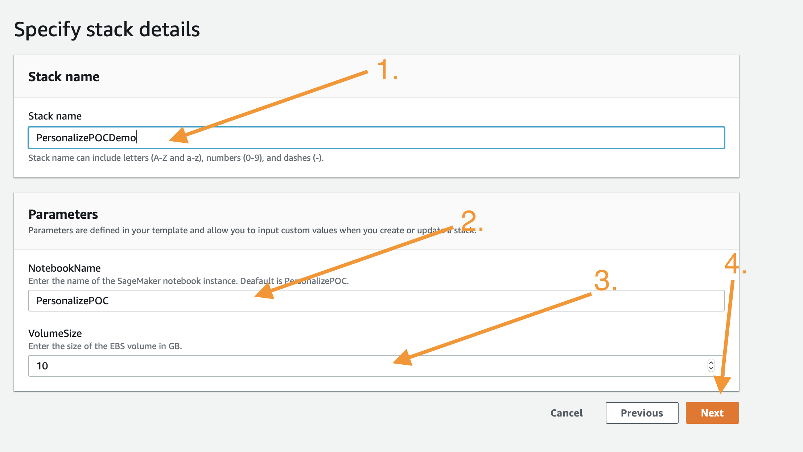
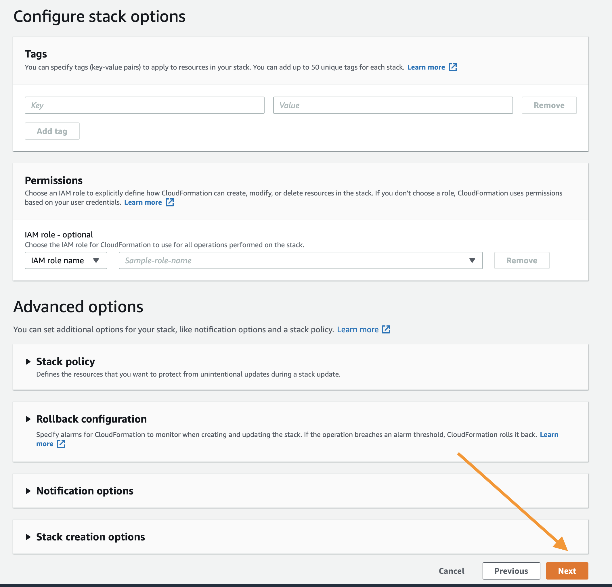

# Guía POC de Personalize

Amazon Personalize es un servicio de machine learning que permite crear y escalar modelos de recomendación/personalización de forma rápida y eficaz. El contenido que aparece a continuación está diseñado para ayudarle a crear sus primeros modelos para su caso de uso determinado y asume que sus datos pueden no estar todavía en un formato ideal para que Amazon Personalize los utilice.

Este repositorio asume una familiaridad básica con el servicio y si aún no lo ha hecho se recomienda que utilice el material de inicio que aparece a continuación.

## Introducción a Amazon Personalize

Si no está familiarizado con Amazon Personalize, puede obtener más información sobre esta herramienta en estas páginas:

* [Página del producto](https://aws.amazon.com/personalize/)
* [Cuadernos de muestra de GitHub](https://github.com/aws-samples/amazon-personalize-samples)
* [Documentos del producto](https://docs.aws.amazon.com/personalize/latest/dg/what-is-personalize.html)

## Objetivos 

Al finalizar esta POC, debería haber adquirido las siguientes habilidades:

1. Cómo asignar conjuntos de datos a Amazon Personalize.
1. Qué modelos o recetas son adecuados para cada caso de uso.
1. Cómo crear modelos de forma programática.
1. Interpretar las métricas del modelo.
1. Implementar modelos de forma programática.
1. Obtener resultados de Personalize.

## Ejemplo terminado

Los cuadernos se han depurado de toda la información antes de su uso, pero si desea ver un ejemplo completo de este proceso, explore los cuadernos de la carpeta `completed`.

## Proceso:

1. Implementación de su entorno de trabajo [ver más abajo]
1. Validación e importación de datos de interacción entre el usuario y los elementos -
`01_Validating_and_Importing_User_Item_Interaction_Data.ipynb`
1. Validación e importación de los metadatos de elementos -
`02_Validating_and_Importing_Item_Metadata.ipynb`
1. Creación y evaluación de sus primeras soluciones -
`03_Creating_and_Evaluating_Solutions.ipynb`
1. Implementación de campañas y filtros -
`04_Deploying_Campaigns_and_Filters.ipynb`
1. Implementación de campañas y filtros -
`05_Interacting_with_Campaigns_and_Filters.ipynb`
1. Limpieza de los recursos en su cuenta de AWS - `06_Clean_Up_Resources.ipynb`

Este es el orden habitual de este proceso; sin embargo, si usted opera esto como una POC asistida de 2 días en el sitio, se recomienda que al menos importe los datos de interacción entre el usuario y los elementos y los metadatos de los elementos antes de llegar en persona.

## Implementación de su entorno de trabajo

Como se mencionó anteriormente, el primer paso es implementar una plantilla de CloudFormation que se encargará de la mayor parte de la configuración inicial. Inicie sesión en su cuenta de AWS en otra ventana o pestaña del navegador. Cuando ingrese a su cuenta, abra el enlace que aparece debajo en una nueva pestaña para comenzar el proceso de implementación de los elementos que necesita mediante CloudFormation.

Siga las instrucciones en las capturas de pantalla si tiene alguna pregunta sobre la implementación de la pila.

### Asistente de CloudFormation

Haga clic en `Next` (Siguiente), al final, de esta manera:

En esta página deberá llevar a cabo algunas tareas:

1. Cambie el nombre de la pila por uno relevante, como `PersonalizePOC`
1. Cambiar el nombre del cuaderno (opcional)
1. Modifique el tamaño del volumen para el volumen de EBS de SageMaker. De forma predeterminada, tiene 10 GB, si su conjunto de datos es mayor, aumente el volumen de acuerdo con esa medida.

Cuando termine, haga clic en `Next` (Siguiente) al final.

Esta página es un poco más larga, deslícese hasta el final y haga clic en `Next` (Siguiente). La configuración predeterminada debería ser suficiente para completar la POC. Si necesita requerimientos personalizados, modifique lo que sea necesario.

Deslícese hasta final otra vez, marque la casilla para permitir que la plantilla cree recursos nuevos de IAM y, luego, haga clic en `Create Stack` (Crear pila).

CloudFormation tardará unos minutos en crear los recursos descritos arriba. Para su beneficio, se verá de esta manera mientras está aprovisionando:

Una vez completo, verá texto en verde, como el que aparece abajo, que indica que el trabajo se completó:

Ahora que ya creó el entorno, haga clic en `Services` (Servicios), en la parte superior de la consola, y luego en `SageMaker` para ir a la página de servicio de SageMaker.

En la consola de SageMaker, deslice hasta encontrar la casilla verde que indica cuántos cuadernos tiene en servicio y haga clic en ella.

En esta página, verá una lista de todos los cuadernos de SageMaker que tiene en ejecución. Haga clic en el enlace `Open JupyterLab` (Abrir JupyterLab) en el cuaderno de POC de Personalize que creó.

Esto abrirá el entorno de Jupyter para su POC. Si no está familiarizado con el entorno, piense en él como un IDE de ciencia de datos basado en la web. Debería abrir la carpeta `PersonalizePOC` automáticamente; si no es así, solo tiene que hacer clic en el icono de la carpeta en el navegador de la parte izquierda de la pantalla y seguir la documentación que aparece a continuación para empezar con su POC.

## Validación e importación de los datos de interacción entre el usuario y los elementos

Los datos centrales de todos los algoritmos que admite Amazon Personalize son los datos de interacción entre el usuario y los elementos. Este cuaderno le guiará a través del proceso de identificación de estos datos, luego el ajuste de su formato para el servicio, la definición de su esquema y, por último, su importación.

Abra `01_Validating_and_Importing_User_Item_Interaction_Data.ipynb` y continúe allí.

Una vez que haya completado esto, puede continuar con la importación de metadatos.

## Validación e importación de los metadatos de elementos

Amazon Personalize tiene varios algoritmos que pueden dar resultados sin metadatos. Sin embargo, el algoritmo de Personalización del usuario y Metadatos HRNN podría ser un recurso interesante para implementar, dependiendo de su conjunto de datos.

Abra `02_Validating_and_Importing_Item_Metadata.ipynb` y continúe allí.

Una vez que haya completado esto, puede continuar con la creación y evaluación de sus primeras soluciones.

Es similar al proceso para los usuarios y los únicos algoritmos que admiten cualquiera de los dos tipos de datos son Personalización del usuario y Metadatos HRNN.

## Creación y evaluación de sus primeras soluciones

En Amazon Personalize existe el concepto de solución, que es un modelo entrenado basado en los datos que ha proporcionado al servicio. Todos los modelos son privados y no se comparten datos entre cuentas o incluso entre grupos de datos. Este cuaderno lo guiará a través del proceso de entrenamiento de modelos, es decir, la creación de una solución para lo siguiente:

* HRNN
* SIMS
* Clasificación personalizada

Algo que quizás pueda observar es que cada uno de estos algoritmos o recetas resuelve un problema críticamente diferente. El objetivo es enseñarle a crear cosas que aborden una serie de problemas a partir de un conjunto de datos relativamente sencillo.

Abra `03_Creating_and_Evaluating_Solutions.ipynb` y siga para crear estas soluciones y ver sus resultados.

### Implementación de campañas y filtros

Una vez que tenga una serie de soluciones entrenadas, el siguiente paso es implementarlas. Esto se hace en `04_Deploying_Campaigns_and_Filters.ipynb`

Aquí aprenderá lo siguiente:
1. Planificación de la implementación y la capacidad
1. Creación de filtros de elementos y eventos

### Interacción con Personalize

Una vez que tenga una serie de soluciones entrenadas, el siguiente paso es implementarlas. Esto se hace en `05_Interacting_with_Campaigns_and_Filters.ipynb`. Aquí aprenderá lo siguiente:

1. Cómo interactuar con una solución implementada (varios enfoques)
1. Interacciones en tiempo real
1. Uso de filtros con campañas
1. Exportación por lotes

### Próximos pasos

Una vez que haya leído estos cuadernos, debería tener una serie de modelos de trabajo para su cliente. A partir de aquí, buscará aprovechar la forma en que el cliente realiza las pruebas A/B en la actualidad con respecto a sus objetivos (conversiones, clics, etc.) y, a continuación, empezará a enviar tráfico a estos modelos y a supervisar esas métricas. Con el tiempo, esto debería generar confianza y será su camino hacia la producción a escala.

Pronto habrá más contenidos sobre las pruebas A/B.

### Limpieza

¿Terminó con la POC? Si desea eliminar todos los recursos creados en su cuenta de AWS mientras sigue estos cuadernos, consulte el cuaderno `06_Clean_Up_Resources.ipynb`. Le ayudará a identificar todos los recursos de Personalize implementados en su cuenta y le mostrará cómo eliminarlos.