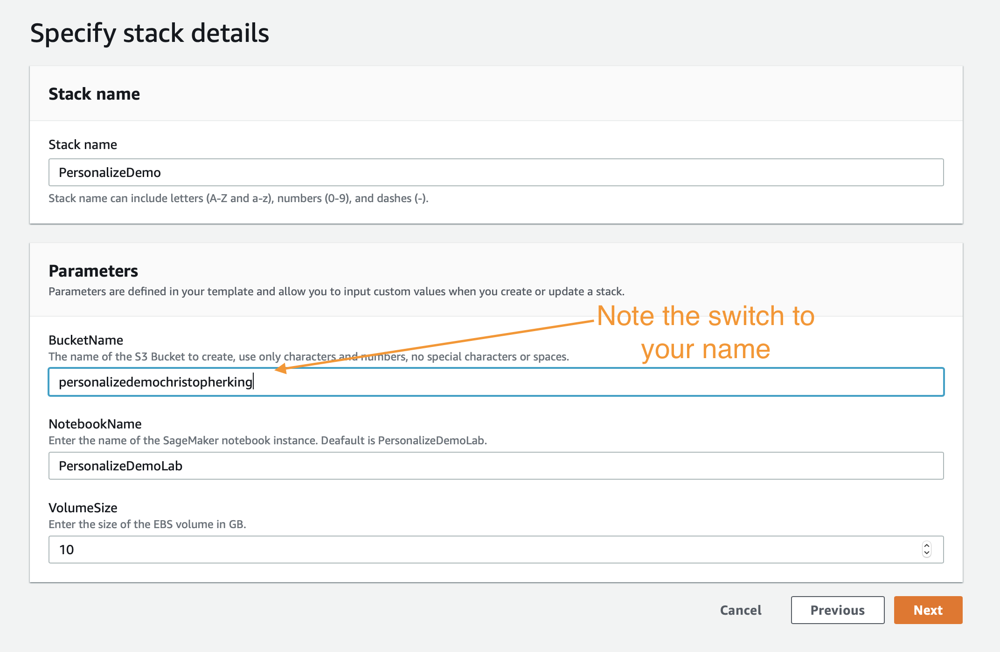
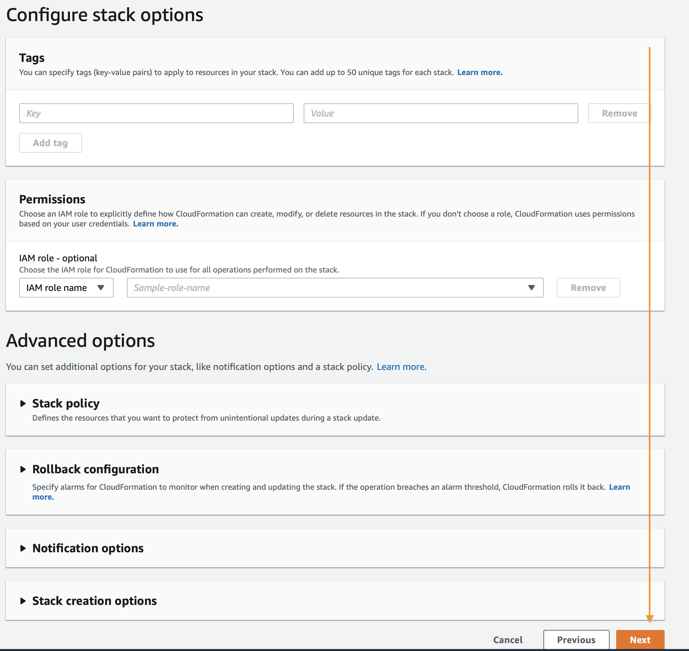
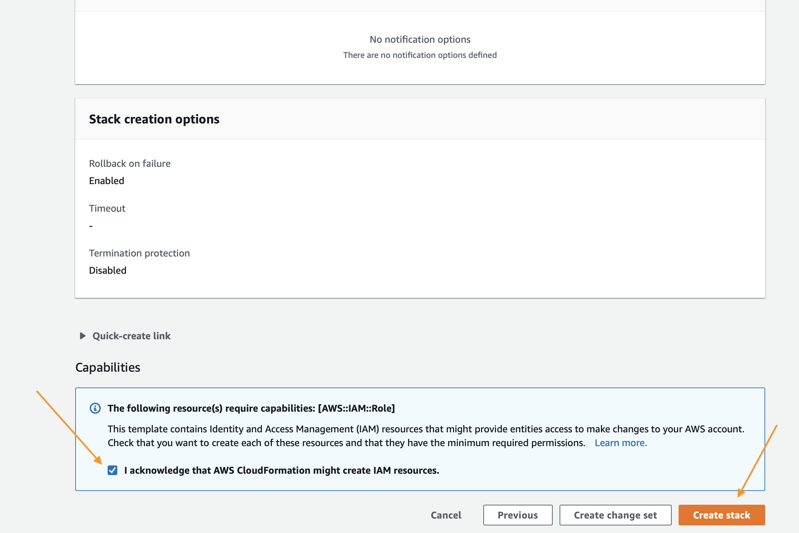

# Introducción

El siguiente tutorial lo guiará en el proceso de crear un entorno para elaborar un conjunto de datos personalizado, un modelo y una campaña de recomendación con Amazon Personalize. Si tiene algún problema con el contenido, inicie un asunto en el repositorio.

## Requisitos previos

Estos requisitos solo se tienen en cuenta si implementa desde la plantilla de CloudFormation. De lo contrario, consulte los permisos de IAM necesarios para su tarea específica.

1. Cuenta de AWS
2. Usuario con acceso de administrador a la cuenta de AWS

## re:Invent 2019

Si está creando este taller para re:Invent 2019, solo haga clic en el botón Launch Stack (Lanzar pila) que aparece debajo. ¡Ejecute la instancia del cuaderno de Jupyter y abra las carpetas "getting_started" y `ReInvent2019_Workshop.ipynb`!

Siga las instrucciones en las capturas de pantalla si tiene alguna pregunta acerca de estos pasos.

### Asistente de CloudFormation

Primero, haga clic en `Next` (Siguiente), al final, de esta manera:

En página siguiente, deberá proveer un nombre único para un bucket de S3 para el almacenamiento de archivos. Se recomienda agregar su nombre y apellido al final de la opción predeterminada, como se muestra debajo. Al finalizar, haga clic en `Next` (Siguiente) de nuevo.

Esta página es un poco más larga, deslícese hasta el final y haga clic en `Next` (Siguiente).

Deslícese hasta final otra vez, marque la casilla para permitir que la plantilla cree recursos nuevos de IAM y, luego, haga clic en `Create Stack` (Crear pila).

CloudFormation tardará unos minutos en crear los recursos descritos arriba. Para su beneficio, se verá de esta manera mientras está aprovisionando:

Una vez completo, verá texto en verde, como el que aparece abajo, que indica que el trabajo se completó:

## Programa

Los pasos que siguen a continuación detallan el proceso para crear su propio modelo de recomendación, implementarle mejoras y, luego, limpiar todos los recursos para prevenir cargos no deseados. Para comenzar a ejecutarlos, realice los pasos que se mencionan en la siguiente sección.

1. `ReInvent2019_Workshop.ipynb`  - Lo guía en el proceso de crear su primera campaña y el algoritmo de recomendación.

## Uso de los cuadernos

Haga clic en `Services` (Servicios) en la parte superior de la barra de navegación de la consola de AWS y navegue hasta la página de servicio de SageMaker.

En el campo de búsqueda, ingrese `SageMaker` y, luego, haga clic en el servicio cuando este aparezca. Una vez en la página del servicio, haga clic en el enlace `Notebook Instances` (Instancias de cuadernos) que aparece en la barra de menú a la izquierda.

Para acceder a la interfaz de Jupyter, simplemente haga clic en `Open JupyterLab` (Abrir JupyterLab) en el extremo derecho junto a su instancia de cuaderno.

El enlace tardará unos segundos en redirigirlo al sistema Jupyter. Una vez allí, debería ver una colección de archivos a la izquierda. Para comenzar, haga clic en el archivo `1.Building_Your_First_Campaign.ipynb`.

El resto del laboratorio tendrá lugar en los cuadernos de Jupyter, solo lea cada bloque antes de ejecutarlo y continuar con el siguiente. Si tiene preguntas sobre cómo utilizar los cuadernos, pregunte a su instructor o, si está trabajando de forma independiente, puede mirar este video para dar los primeros pasos:

https://www.youtube.com/watch?v=Gzun8PpyBCo

## Después de los cuadernos

Una vez que haya completado todo el trabajo en los cuadernos, así como también los pasos de limpieza que aparecen allí, lo último que queda por hacer es eliminar la pila que creó con CloudFormation. Para hacer eso, dentro de la consola de AWS, haga clic en el enlace `Services` (Servicios), que aparece al principio, ingrese en `CloudFormation` y haga clic en enlace para este.

Haga clic en el botón `Delete` (Eliminar) en la pila de demostración que creó:

Por último, haga clic en el botón `Delete Stack` (Eliminar pila) que aparece en el mensaje emergente:

Ahora, notará que la pila se encuentra en proceso de eliminación. Cuando vea el mensaje `Delete Completed` (Eliminación completa) sabrá que se borró todo y que terminó este laboratorio por completo.

