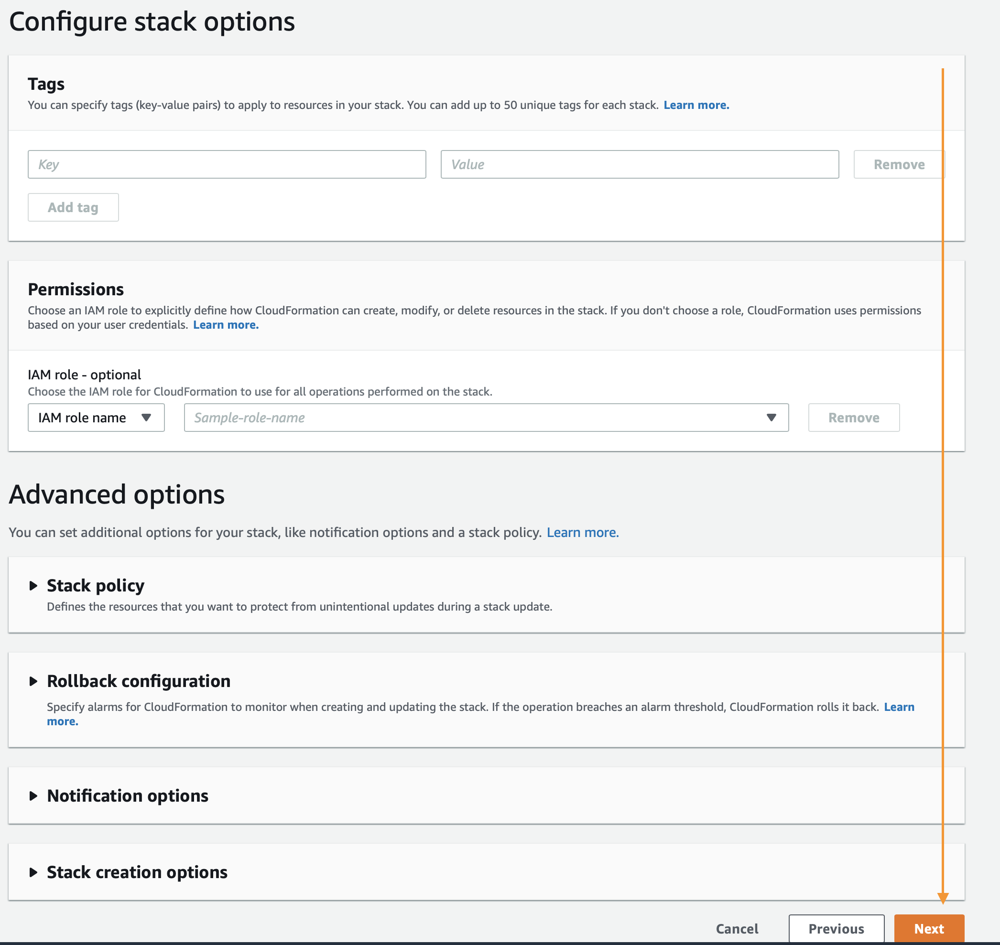
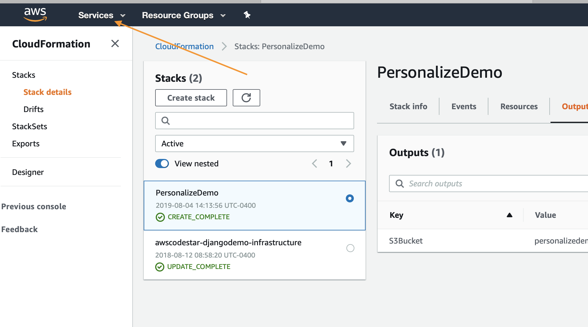

# Creación de su propio recomendador de películas
Este tutorial le muestra cómo construir su propio recomendador de películas.
Verá cómo puede crear recursos en Amazon Personalize que generen recomendaciones, ¡como la Máquina mágica de películas!

## Resumen del tutorial
Completar este tutorial implica los siguientes pasos:

1. Siga las instrucciones de este archivo para crear su entorno y encontrar los cuadernos en AWS Sagemaker. Esto implica la implementación de una pila de AWS CloudFormation que configura el entorno de los portátiles por usted.
2. Ejecute el cuaderno `Building_the_Magic_Movie_Machine_Recommender.ipynb` en AWS Sagemaker. Implementó este cuaderno en el primer paso. Este cuaderno le guía en la creación de sus primeros recomendadores de películas y en la obtención de sus primeras recomendaciones.
3. Ejecute `Clean_Up_Resources.ipynb`. Este cuaderno borra todo lo que se creó en el cuaderno anterior para que no se le cobren recursos adicionales.
4. Elimine la pila de AWS CloudFormation para eliminar los recursos del entorno que creó en el paso 2.

*Nota*: Puede explorar el cuaderno directamente en GitHub. Sin embargo, para ejecutarlo con éxito debe seguir los pasos a continuación para desplegar el cuaderno en un entorno preconfigurado.

## Creación de su entorno 
Antes de que pueda crear su propio recomendador de películas, debe crear un entorno de trabajo como el siguiente:

1. Asegúrese de que ha cumplido los requisitos previos de entorno que se indican a continuación.
2. Implemente la pila de AWS CloudFormation.
3. Navegue a la consola de Amazon SageMaker.

### Requisitos previos del entorno

Para implementar con la plantilla de CloudFormation, debe tener lo siguiente.

1. Una cuenta de AWS
2. Un usuario con acceso de administrador a la cuenta de AWS

### Implementación del entorno

El primer paso es implementar una plantilla de CloudFormation que realizará gran parte del trabajo de configuración inicial por usted. Inicie sesión en su cuenta de AWS en otra ventana del navegador. Cuando ingrese a su cuenta, abra el enlace que aparece debajo en una nueva pestaña para comenzar el proceso de implementación de los elementos que necesita mediante CloudFormation.

Siga las capturas de pantalla que aparecen a continuación si tiene alguna duda sobre estos pasos.

  
Haga clic para ampliar las instrucciones.

  
### Por medio del asistente de inicio de AWS CloudFormation,

haga clic en `Next` (Siguiente) al final, tal como se muestra:

En la página siguiente, deberá proveer un nombre único para un bucket de S3 para el almacenamiento de archivos. Se recomienda agregar su nombre y apellido al final de la opción predeterminada, como se muestra debajo. Al finalizar, haga clic en `Next` (Siguiente) de nuevo.

Esta página es más extensa, deslícese hasta el final y haga clic en `Next` (Siguiente).

Deslícese otra vez hasta el final, compruebe la casilla para permitir a la plantilla la creación de recursos nuevos de IAM y luego haga clic en `Create Stack` (Crear pila).

CloudFormation tardará unos minutos en crear los recursos descritos arriba. Para su beneficio, se verá de esta manera mientras está aprovisionando:

Una vez completo, verá texto en verde, como el que aparece abajo, que indica que el trabajo se completó:

Ahora que ha creado el entorno, necesita guardar el nombre de su bucket de S3 para uso futuro. Para buscar el nombre, haga clic en la pestaña `Outputs` (Salidas) y, luego, busque el recurso `S3Bucket` (Bucket de S3). Cuando lo encuentre, cópielo y péguelo, de momento, en un archivo de texto.

### Uso de los cuadernos

Primero, navegue hasta la [página](https://console.aws.amazon.com/sagemaker/home) de aterrizaje de Amazon SageMaker. Desde la página de servicio, haga clic en el enlace `Notebook Instances` (Instancias de cuadernos) en la barra de menú de la izquierda.

Para acceder a la interfaz de Jupyter, simplemente haga clic en `Open JupyterLab` (Abrir JupyterLab) en el extremo derecho junto a su instancia de cuaderno.

El enlace tardará unos segundos en redirigirlo al sistema Jupyter. Una vez allí, debería ver una colección de archivos a la izquierda.

Para empezar, diríjase a la carpeta next_steps > workshops > magic_movie_machine > notebooks > Building the Magic Movie Machine Recommender.pynb

`amazon-personalize-samples/next_steps/workshops/magic_movie_machine/notebooks/Building the Magic Movie Machine Recommender.ipynb`

Asegúrese de elegir un núcleo que utilice Python 3.x (el nombre del núcleo terminará con p3x) antes de ejecutar el laboratorio. El resto del laboratorio tendrá lugar en los cuadernos de Jupyter, solo lea cada bloque antes de ejecutarlo y continuar con el siguiente. Si tiene alguna duda sobre cómo utilizar los cuadernos, este es un buen video para empezar:

https://www.youtube.com/watch?v=Gzun8PpyBCo

## Eliminación de recursos del entorno

Una vez que haya completado todo el trabajo en los cuadernos, así como también los pasos de limpieza que aparecen allí, lo último que queda por hacer es eliminar la pila que creó con CloudFormation. Para hacer eso, dentro de la consola de AWS, haga clic en el enlace `Services` (Servicios), que aparece al principio, ingrese en `CloudFormation` y haga clic en enlace para este.

Haga clic en el botón `Delete` (Eliminar) en la pila de demostración que creó:

Por último, haga clic en el botón `Delete Stack` (Eliminar pila) que aparece en el mensaje emergente:

Ahora, notará que la pila se encuentra en proceso de eliminación. Cuando vea el mensaje `Delete Completed` (Eliminación completa) sabrá que se borró todo y que terminó este laboratorio por completo.

