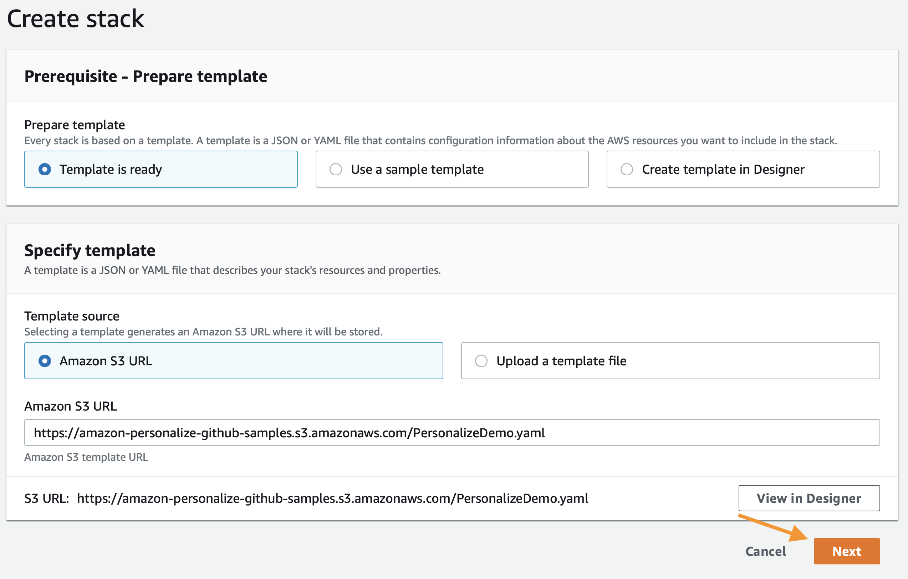
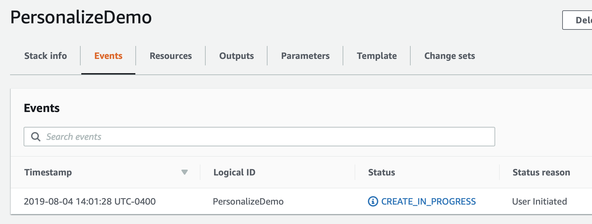

# Démarrage

Ce didacticiel explique comment commencer à utiliser Amazon Personalize :

1. Création d'un environnement de travail (voir les étapes ci-dessous)
2. Créer vos premiers mécanismes de recommandation optimisés pour la vidéo à la demande et le commerce électronique
3. Créer votre premier jeu de données, votre premier modèle et votre première campagne de recommandation personnalisés

## Conditions préalables pour l'environnement

Ne s'applique que si vous déployez avec le modèle CloudFormation. Autrement, reportez-vous aux autorisations IAM nécessaires à votre tâche.

1. Compte AWS
2. Utilisateur ayant un accès administrateur au compte AWS

## Création de votre environnement

La première étape consiste à déployer un modèle CloudFormation qui effectuera une grande partie de la configuration initiale pour vous. Dans une autre fenêtre du navigateur, connectez-vous à votre compte AWS. Une fois que cela est fait, ouvrez le lien ci-dessous dans un nouvel onglet pour lancer le processus de déploiement des articles dont vous avez besoin à partir de CloudFormation.

Suivez les captures d'écran si vous avez des questions sur ces étapes.

  
Cliquer pour développer les instructions

  
### Cloud Formation WizardStart en cliquant sur « Next » dans la partie inférieure, comme indiqué :

Sur la page suivante, vous devez fournir un nom de compartiment S3 unique pour votre stockage de fichiers. Il est recommandé d'ajouter simplement votre prénom et votre nom de famille à la fin de l'option par défaut comme indiqué ci-dessous. Après cette mise à jour, cliquez à nouveau sur « Suivant ».

Cette page étant un peu plus longue, faites-la défiler jusqu'en bas pour cliquer sur « Suivant ».

Faites défiler à nouveau jusqu'en bas, cochez la case pour permettre au modèle de créer de nouvelles ressources IAM, puis cliquez sur « Créer une pile ».

Pendant quelques minutes, CloudFormation créera les ressources décrites ci-dessus en votre nom ; ce processus ressemblera à ceci pendant le provisionnement :

Une fois terminé, vous verrez un texte vert comme ci-dessous indiquant que le travail est achevé :

Maintenant que vous avez créé votre environnement, vous devez enregistrer le nom de votre compartiment S3 pour une utilisation future. Pour le trouver, cliquez sur l'onglet « Résultats » et recherchez la ressource « S3Bucket ». Une fois que vous l'avez trouvée, copiez-la et collez-la dans un fichier texte pour le moment.

## Utilisation des blocs-notes

Commencez par naviguer vers la [page](https://console.aws.amazon.com/sagemaker/home) d'accueil Amazon SageMaker. À partir de la page du service, cliquez sur le lien `Notebook Instances` dans la barre de menus située à l'extrémité gauche.

Pour accéder à l'interface Jupyter, il suffit de cliquer sur `Open JupyterLab` à l'extrémité droite à côté de votre instance de bloc-notes.

Vous serez redirigé vers le système Jupyter quelques secondes après avoir cliqué sur le lien ouvert. Toutefois, une fois dans le système, vous devriez voir une collection de fichiers sur votre gauche.

Pour commencer, naviguez jusqu'au premier bloc-notes en utilisant les [groupes de jeux de données de domaine et les mécanismes de recommandations optimisés pour les cas d'utilisation](https://docs.aws.amazon.com/personalize/latest/dg/create-domain-dataset-group.html).

`amazon-personalize-samples/getting_started/notebooks/Building_Your_First_Recommender_Video_On_Demand.ipynb`

`amazon-personalize-samples/getting_started/notebooks/Building_Your_First_Recommender_Ecommerce.ipynb`

ou en utilisant des [groupes de jeux de données personnalisés](https://docs.aws.amazon.com/personalize/latest/dg/custom-dataset-groups.html) :

`amazon-personalize-samples/getting_started/notebooks/1.Building_Your_First_Campaign.ipynb`

Le reste des analyses se déroulera par l'intermédiaire des blocs-notes Jupyter. Il suffit de lire chaque bloc avant de l'exécuter et de passer au suivant. Si vous avez des questions sur la façon d'utiliser les blocs-notes, demandez à votre instructeur. Si vous travaillez de façon autonome, cette vidéo est très utile pour commencer :

https://www.youtube.com/watch?v=Gzun8PpyBCo

## Après les blocs-notes

Une fois que vous avez terminé tous les travaux se trouvant dans les blocs-notes et que vous avez aussi terminé les étapes de nettoyage, la dernière chose à faire est de supprimer la pile que vous avez créée avec CloudFormation. Pour ce faire, à l'intérieur de la console AWS, cliquez à nouveau sur le lien `Services` en haut. Cette fois, saisissez `CloudFormation` et cliquez sur le lien pour cela.

Cliquez sur le bouton `Delete` de la pile de démonstration que vous avez créée :

Enfin, cliquez sur le bouton `Delete Stack` qui s'affiche dans la fenêtre contextuelle :

Vous remarquerez maintenant que la pile est en cours de suppression. Une fois que vous voyez `Delete Completed`, sachez que tout a été supprimé et que vous avez terminé complétement l'atelier.

