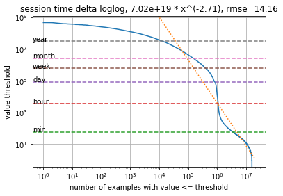

Outils de diagnostic/visualisation des données
===
Veuillez utiliser [diagnose.py](diagnose.py) pour examiner l'ensemble de données afin de détecter tout problème manifeste tel que des données manquantes ou des fonctionnalités d'éléments.
Vous trouverez des exemples de l'utilisation de diagnose.py dans [exemple_ml_100k.ipynb](example_ml_100k.ipynb), [exemple_ml_1m.ipynb](example_ml_1m.ipynb), [exemple_ml_20m.ipynb](example_ml_20m.ipynb).

Nous présenterons quelques exemples de sorties du tableau des interactions. L'outil examine également les utilisateurs et les tableaux d'éléments de manière similaire.

Tableau d'interactions, forme originale=(20000263, 4)
---

Tout d'abord, nous vérifions les données manquantes et les doublons dans le tableau des interactions. Nous prévoyons un grand nombre d'interactions et des données manquantes négligeables (<10 %) dans tous les domaines. Les doublons apparaissant dans tous les éléments (USER_ID, ITEM_ID, TIMESTAMP) sont supprimés par le système.
```
missing rate in fields ['USER_ID', 'ITEM_ID', 'TIMESTAMP'] 0.0
dropna shape (20000263, 4)
duplication rate 0.0
drop_duplicates shape (20000263, 4)
```
Nous vérifions également les activités récurrentes de l'utilisateur dans l'historique de l'utilisateur. Des indices de répétition élevés (>50 %) indiquent généralement de longues périodes d'utilisation et il peut être bénéfique d'envisager de ne retenir que les dernières interactions (en abandonnant toutes les autres) ou d'utiliser des modèles hiérarchiques (TODO).
```
user item repeat rate 0.0
```

Décrire le tableau des interactions
---

Pour chaque colonne de données, nous présentons une description des principales statistiques.
Concernant les variables numériques, une diversité/indépendance suffisante indique généralement le fait que la variable peut être un facteur de cause pouvant être utilisé dans le modèle, au détriment d'un facteur d'effet moins informatif pour nos tâches d'apprentissage.

Pour des colonnes catégoriques, telles que ITEM_ID, nous ajustons en plus une fonction de loi de puissance sur la distribution du nombre de catégories uniques.
Nous reportons les seuils de comptage en fonction du nombre de catégories dont les valeurs sont supérieures ou égales aux seuils.
Une ligne droite dans le graphique log-log correspond à un changement relatif du seuil qui devrait entraîner un changement relatif proportionnel du nombre de catégories au-dessus du seuil.


Le coefficient de proportion, dans ce cas, -2,48, et l'erreur quadratique moyenne (rmse) sont ajustés en fonction de la qualité de l'ajustement dans l'espace log-log.
Le coefficient doit être négatif.

   Un coefficient de forte amplitude (<-2) indique que la distribution est « head-heavy », ce qui signifie que les activités sont orientées vers très peu de catégories.
   Dans ce cas, il faut être attentif à la couverture des catégories. Par exemple, le nombre d'ITEM_ID peut être faussé en faveur de quelques catégories lorsque le système existant dispose d'une mise en page non personnalisée et que les premières catégories sont souvent consultées en raison d'un biais positionnel.
   L'inclusion des contextes positionnels dans les modèles permet de diversifier les résultats, permettant ainsi une meilleure personnalisation.

   Un coefficient de faible amplitude (>-0,5) suppose une distribution à queue lourde, ce qui signifie que les comptes sont plutôt uniformes.
   Une distribution uniforme des ITEM_ID reste un cas favorable, car elle ne tient pas compte de la corrélation entre les activités.
   Grâce à la recommandation basée sur l'utilisateur et l'élément, on peut s'attendre à ce que le ou les éléments passés réduisent le nombre d'ITEM_ID à recommander à l'avenir.

Toutes ces corrections par la personnalisation peuvent fonctionner jusqu'à une certaine limite.
Nous émettons des directives d'avertissement pour indiquer une estimation très générale des limites de la capacité de modélisation.
Elles pourraient être erronées dans un cas d'utilisation spécifique. À utiliser avec précaution.

Analyse du décalage temporel
---

La recommandation intervient dans un environnement dynamique où de nouveaux contenus sont rapidement créés et les anciens rendus obsolètes.
Il en résulte deux défis : le recommandeur doit fréquemment être recyclé à l'aide de nouvelles informations et il doit appliquer des seuils stricts ou réévaluer les anciens exemples avec le recency_mask.

L'analyse de fréquence de réentraînement suivante a pour objet de prédire la distribution marginale de la popularité des éléments dans chaque période de temps en utilisant respectivement la popularité bootstrap de la même période et la popularité de la dernière période.
Chaque point de données correspond à la moyenne pondérée de toutes les périodes à la fréquence spécifiée.
Lorsque la popularité différée entraîne une perte nettement plus importante que le bootstrap de la même période, il faut procéder à un recyclage.
Dans ce tableau, la fréquence optimale de recyclage est d'au moins une fois par mois (movielens est un ensemble de données d'enquête et le contenu évolue lentement).


En outre, l'analyse de décalage temporel suivante vise à prédire la distribution marginale des articles dans les prochaines périodes de temps en utilisant l'historique de roulement des X dernières périodes.
L'analyse compile des moyennes pondérées par la densité d'activité mais ne présente que les 100 derniers points pour plus de clarté.
La configuration optimale doit être définie comme le seuil critique des données historiques ou la demi-vie de la pondération par récence (TODO).
Dans cet exemple, la conservation optimale de l'historique porte sur les 50 derniers jours.
Toutefois, les solutions Personalize intègrent déjà le masque recency_mask et, en cas de doute, il est judicieux de conserver des historiques d'utilisateurs plus longs.


La perte principale que nous analysons est la perte de variation totale (TV), bien que nous incluions également le pourcentage de perte de trafic dû aux éléments hors échantillon, qui explique en partie la grande perte de TV.
Pour les clients subissant une perte importante due à des articles hors échantillon, veuillez consulter notre [recette COLD-START](../personalize_temporal_holdout/personalize_coldstart_demo.ipynb).


session time delta describe
---

Pour les utilisateurs ayant un long historique, il est souvent utile de regrouper les historiques des utilisateurs en sessions courtes, au sein desquelles les utilisateurs tendent à conserver des intérêts similaires.
Nous utilisons le time-delta pour décider des signaux de début de session (BoS).
Notre document de recherche [1] montre que ces signaux améliorent considérablement la qualité des recommandations.
Le graphique suivant montre la distribution en loi de puissance des délais entre toutes les paires d'activités adjacentes.



D'après le graphique, nous pouvons lire que moins de 10 % de tous les intervalles de temps ont des intervalles de plus d'une minute et moins de 1 % ont des intervalles de plus d'un mois.
Si nous définissons un seuil de session à 1 minute, nous nous retrouvons avec 10 % des signaux BoS au niveau inter-session.
Si l'on combine avec le modèle de loi de puissance de USER_ID, cela indique que les utilisateurs ont en moyenne 10 sessions dans leur historique d'activité.

À titre d'information, l'ensemble de données movielens possède un seuil de session plutôt court, car il provient d'un site web d'enquêtes sur les films.
D'autres types d'ensembles de données présentent généralement des seuils BoS plus larges et plus étendus, où nous pouvons également définir des hiérarchies de sessions multiples (TODO).

#### Références
[1] Yifei Ma, Balakrishnan (Murali) Narayanaswamy. Systèmes de recommandation hiérarchiques temporels-contextuels. Atelier NIPS 2018 sur la modélisation et la prise de décision dans les domaines spatio-temporels. [lien](https://openreview.net/forum?id=ByzxsrrkJ4)
