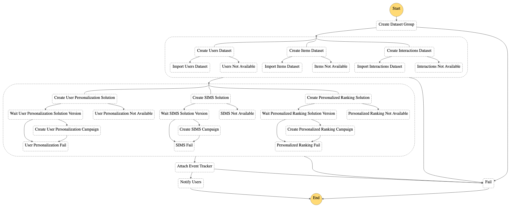

**Cet exemple a été remplacé par la solution AWS [Maintenir des expériences personnalisées grâce au machine learning](https://aws.amazon.com/solutions/implementations/maintaining-personalized-experiences-with-ml/). Cette solution vous permet d'automatiser le processus de bout en bout d'importation des jeux de données, vous donnant ainsi la possibilité de créer des solutions et des versions de ces solutions, de créer et de mettre à jour des campagnes, de créer des filtres ainsi que d'exécuter des tâches d'inférence par lot. Ces processus peuvent être exécutés à la demande ou déclenchés en fonction d'un calendrier que vous définissez.**

# Démarrage

Le MLOps gagne beaucoup en popularité. Cet exemple présente un élément clé que vous pouvez utiliser pour construire votre pipeline d'automatisation. Comme nous pouvons le voir dans le diagramme d'architecture suivant, vous allez déployer un flux AWS Step Function contenant des fonctions Lambda qui appellent les API Amazon S3, Amazon Personalize et Amazon SNS.

Ce package contient le code source d'un pipeline Step Functions qui est en mesure d'effectuer
plusieurs actions dans **Amazon Personalize**, dont ce qui suit :

- Création d'un groupe de jeux de données
- Création et importation de jeux de données
- Création d'une solution
- Création d'une version de solution
- Création d'une campagne

Une fois ces étapes terminées, Step Functions informe les utilisateurs de la fin de l'opération à l'aide d'une
rubrique SNS.

Le diagramme ci-dessous présente l'architecture de la solution :


Le diagramme ci-dessous présente la définition du flux StepFunction :



## Conditions préalables

### Installation d'AWS SAM

Le modèle d'application sans serveur AWS (SAM) est un cadre open-source pour la création d'applications sans serveur. Il fournit une syntaxe abrégée pour exprimer les fonctions, les API, les bases de données et les mappages de sources d'événements. Avec seulement quelques lignes par ressource, vous pouvez définir l'application que vous voulez et la modéliser à l'aide de YAML. Lors du déploiement, SAM transforme et étend la syntaxe SAM dans la syntaxe AWS CloudFormation, ce qui vous permet de créer des applications sans serveur plus rapidement.

**Installer** l'[AWS SAM CLI](https://docs.aws.amazon.com/serverless-application-model/latest/developerguide/serverless-sam-cli-install.html).
Vous allez ainsi installer les outils nécessaires pour créer, déployer et tester localement votre projet. Dans cet exemple particulier, nous utiliserons AWS SAM pour créer et déployer uniquement. Pour plus d'informations, veuillez consulter notre ​​[documentation](https://docs.aws.amazon.com/serverless-application-model/latest/developerguide/what-is-sam.html)​​.

## Créer et déployer

Pour déployer le projet, vous devrez exécuter les commandes suivantes :

1. Cloner le référentiel des exemples d'Amazon Personalize
    - `git clone https://github.com/aws-samples/amazon-personalize-samples.git`
2. Accéder au répertoire *next_steps/operations/ml_ops/personalize-step-functions*
    - `cd next_steps/operations/ml_ops/personalize-step-functions`
3. Créez votre projet SAM. [Instructions d'installation](https://docs.aws.amazon.com/serverless-application-model/latest/developerguide/serverless-sam-cli-install.html)
    - `sam build`
4. Déployez votre projet. SAM offre une option de déploiement guidé. Notez que vous devrez fournir votre adresse e-mail comme paramètre nécessaire pour recevoir une notification.
    - `sam deploy --guided`
5. Accéder à votre boîte de réception et confirmez votre abonnement à la rubrique SNS

Le pipeline vous demande de fournir une adresse e-mail et un nom par défaut pour le fichier de paramètres.

Une fois déployée, la solution crée le **InputBucket** que vous pouvez trouver dans la sortie de la pile CloudFormation. Utilisez-le pour charger vos jeux de données
en utilisant la structure suivante :

```bash
Users/              # Users dataset(s) folder
Items/              # Items dataset(s) folder
Interactions/       # Interaction dataset(s) folder
```

Après avoir envoyé vos jeux de données, chargez le fichier de paramètres dans **le répertoire racine**. Cette étape
 démarre le flux Step Functions.

## Configuration

Pour utiliser ce déploiement, vous devez configurer correctement un **fichier de paramètres**. Le fichier de paramètres
contient toutes les informations nécessaires pour créer les ressources sur Amazon Personalize. Il récupère
les paramètres à l'aide du [client de personnalisation boto3](https://boto3.amazonaws.com/v1/documentation/api/latest/reference/services/personalize.html).

Le dossier doit inclure les sections suivantes, **toutes obligatoires** :
- `datasetGroup`
- `datasets`
- `solution`
- `campaign`

<details><summary>Voir un exemple du fichier de paramètres</summary>
<p>

```json
{
    "datasetGroup": {
        "name":"DatasetGroup"
    },
    "datasets": {
        "Interactions": {
            "name":"InteractionsDataset",
            "schema": {
              "type": "record",
              "name": "Interactions",
              "namespace": "com.amazonaws.personalize.schema",
              "fields": [
                {
                  "name": "USER_ID",
                  "type": "string"
                },
                {
                  "name": "ITEM_ID",
                  "type": "string"
                },
                {
                  "name": "TIMESTAMP",
                  "type": "long"
                }
              ],
              "version": "1.0"
            }
        },
        "Users": {
            "name": "UsersDataset",
                "schema": {
                "type": "record",
                "name": "Users",
                "namespace": "com.amazonaws.personalize.schema",
                "fields": [
                    {
                        "name": "USER_ID",
                        "type": "string"
                    },
                    {
                        "name": "GENDER",
                        "type": "string",
                        "categorical": true
                    },
                    {
                        "name": "AGE",
                        "type": "int"
                    }
                ],
                "version": "1.0"
            }
        }
    },
    "solution": {
        "name": "Solution",
        "performAutoML": true
    },
    "campaign": {
        "name": "Campaign",
        "minProvisionedTPS": 1
    }
}
```
</p>
</details>

### Structure du fichier de paramètres

Pour savoir comment créer votre fichier de paramètres, référez-vous à [cet exemple](./example/params.json).
Chaque section correspond à un appel d'API.

### Définir un schéma

https://docs.aws.amazon.com/personalize/latest/dg/how-it-works-dataset-schema.html


## Exemple de test

Afin de tester le déploiement, veuillez exécuter la commande suivante **dans le dossier ml_ops** :


```bash
aws s3 sync ./example/data s3://{YOURBUCKETNAME}

aws s3 cp ./example/params.json s3://{YOURBUCKETNAME}
```

Cela lance l'exécution du flux Step Functions. Pour suivre l'exécution, accédez
à la section Step Functions de la console AWS et cliquez sur la machine
d'état **DeployStateMachine-xxx**.

> Vous devez spécifier le nom exact du compartiment S3 créé auparavant. La machine d'état
> démarre lorsque le fichier de paramètres est envoyé au compartiment S3.

## Prochaines étapes

Félicitations ! Vous avez entraîné un modèle Amazon Personalize et créé une campagne. Vous pouvez obtenir des recommandations en tirant parti de l'ARN de votre campagne ou en visitant la section de la campagne du groupe du jeu de données de la [console Amazon Personalize](https://console.aws.amazon.com/personalize/home?region=us-east-1#datasetGroups).

Pour en savoir plus sur l'obtention de recommandations, veuillez vous reporter à notre [documentation](https://docs.aws.amazon.com/personalize/latest/dg/getting-recommendations.html) ou à l'un de nos [exemples détaillés de manuel](https://github.com/aws-samples/amazon-personalize-samples/blob/master/personalize_sample_notebook.ipynb).
