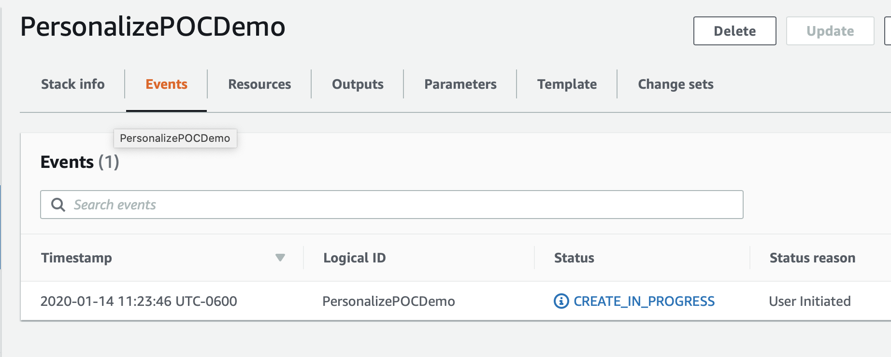

## Journée d'immersion Amazon Personalize

L'objectif de cette journée d'immersion est de fournir un point de départ commun pour apprendre à utiliser les différentes fonctionnalités d'[Amazon Personalize](https://aws.amazon.com/personalize/).

Pour plus de détails sur tout concept mentionné, reportez-vous au [guide du développeur Personalize](https://docs.aws.amazon.com/personalize/latest/dg/what-is-personalize.html)

Dans les blocs-notes, vous apprendrez à :

1. Préparer un jeu de données à utiliser avec Amazon Personalize.
1. Créer des modèles à partir de ce jeu de données.
1. Évaluer la performance d'un modèle en fonction d'observations réelles.

## Ordre du jour

Les étapes ci-dessous décrivent le processus visant à créer vos propres modèles de prévision de séries temporelles, à les évaluer, puis à nettoyer toutes vos ressources afin d'éviter tout frais indésirable. Pour commencer, procédez comme suit.

1. Déployez le modèle CloudFormation ci-dessous ou créez un environnement Jupyter local avec l'AWS CLI installée et configurée pour votre compte IAM.
1. Ce fichier [personalize_hrnn_metadata_contextual_example.ipynb](personalize_hrnn_metadata_contextual_example.ipynb) montre comment ces informations utiles peuvent être chargées sur notre système pour faciliter les recommandations. Une mise en garde qui s'impose est que les améliorations des recettes de métadonnées dépendent de la quantité d'informations pouvant être extraites des métadonnées fournies.

## Conditions préalables 

1. Un compte AWS
1. Un utilisateur dans le compte avec des privilèges administratifs

## Plan

1. Tout d'abord, vous déploierez un modèle CloudFormation qui créera un compartiment S3 pour le stockage de données, une instance de bloc-notes SageMaker où les exercices sont exécutés, des politiques IAM pour l'instance de bloc-notes. Ce modèle va alors cloner ce référentiel dans l'instance de bloc-notes afin que vous soyez prêt à commencer.
1. Ensuite, vous ouvrirez le `personalize_hrnn_metadata_contextual_example.ipynb` pour commencer.
1. Ce bloc-notes vous guidera à travers le processus des autres blocs-notes jusqu'à ce que vous ayez un Amazon Personalize opérationnel et évalué.

## Créer votre environnement :

Comme mentionné ci-dessus, la première étape consiste à déployer un modèle CloudFormation qui effectuera une grande partie du travail de configuration initiale pour vous. Dans une autre fenêtre ou un autre onglet du navigateur, connectez-vous à votre compte AWS. Une fois que cela est fait, ouvrez le lien ci-dessous dans un nouvel onglet pour lancer le processus de déploiement des articles dont vous avez besoin à partir de CloudFormation.

Suivez les captures d'écran ci-dessous si vous avez des questions sur le déploiement de la pile.

### Assistant de Cloud Formation

Commencez par cliquer sur `Next` en bas de la façon suivante :

Sur cette page, vous avez quelques tâches :

1. Donnez à la pile un nom pertinent, par exemple `PersonalizeImmersionDay`
1. Modifier le nom du bloc-notes (facultatif)
1. Modifiez la VolumeSize pour le volume EBS SageMaker : la valeur par défaut est 10 Go. Si votre jeu de données est censé être plus grand, veuillez l'augmenter en conséquence.

Lorsque vous avez terminé, cliquez sur `Next` en bas.

Cette page est un peu plus longue : faites défiler vers le bas pour cliquer sur `Next`. Toutes les valeurs par défaut doivent être suffisantes pour réaliser la POC ; si vous avez des exigences personnalisées, modifiez-les au besoin.

Encore une fois, faites défiler vers le bas, cochez la case pour permettre au modèle de créer de nouvelles ressources IAM, puis cliquez sur `Create Stack`.

Pendant quelques minutes, CloudFormation créera les ressources décrites ci-dessus en votre nom ; ce processus ressemblera à ceci pendant le provisionnement :

Une fois terminé, vous verrez un texte vert comme ci-dessous indiquant que le travail est achevé :

Maintenant que votre environnement a été créé, accédez à la page de service destinée à SageMaker en cliquant sur `Services` en haut de la console, puis en recherchant `SageMaker` et en cliquant sur le service.

À partir de la console SageMaker, faites défiler jusqu'à ce que vous voyiez la case verte indiquant le nombre de blocs-notes que vous avez en service et cliquez dessus.

Sur cette page, vous verrez une liste de tous les blocs-notes SageMaker qui sont opérationnels ; cliquez simplement sur le lien `Open JupyterLab` sur le bloc-notes POC Personalize que vous avez créé

Le clic ouvrira l'environnement Jupyter pour votre POC. Considérez-le comme un IDE de science des données basé sur le web si vous ne le connaissez pas.

Sur votre gauche, accédez au répertoire suivant `amazon-personalize-samples/workshops/Immersion_Day/` et double-cliquez sur le bloc-notes `personalize_hrnn_metadata_contextual_example.ipynb`.