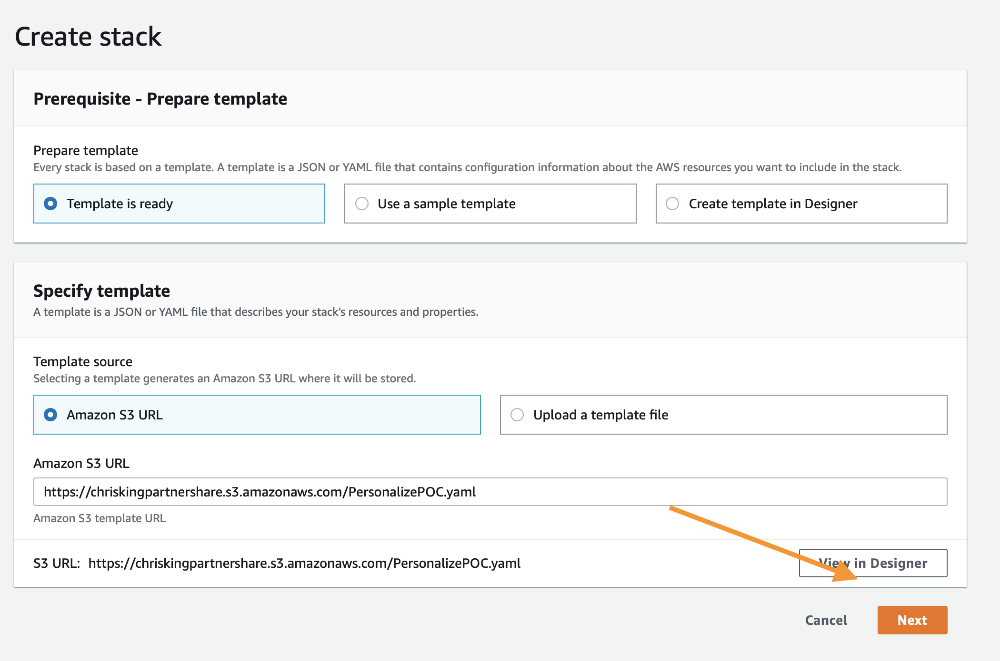
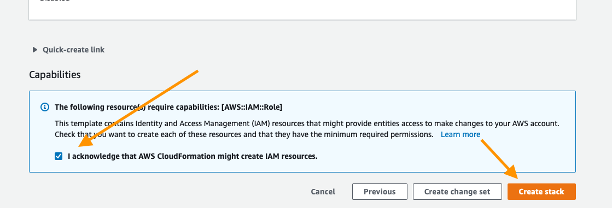
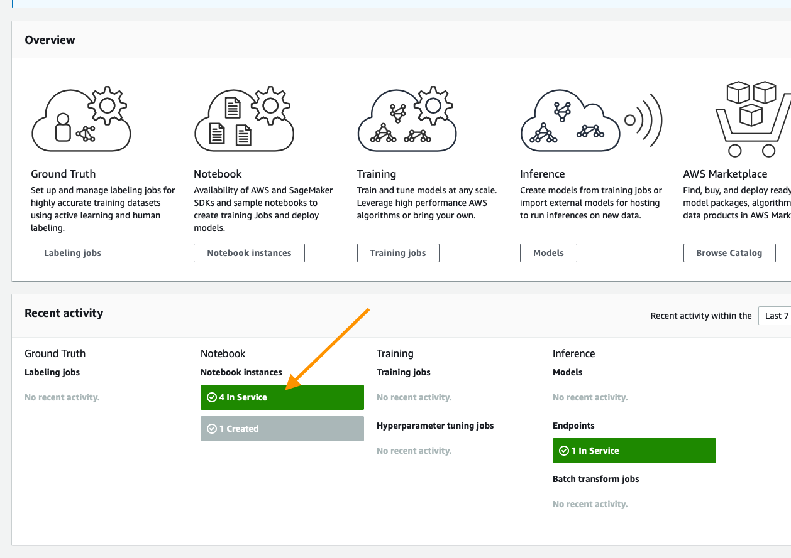

# Guide de POC de Personalize

Amazon Personalize est un service de Machine Learning qui vous permet de créer et de mettre à l'échelle des modèles de recommandation/personnalisation plus rapidement et plus efficacement. Le contenu ci-dessous est conçu pour vous aider à créer vos premiers modèles pour votre cas d'utilisation donné et suppose que vos données ne sont peut-être pas encore dans un format idéal pour Amazon Personalize.

Pour utiliser ce référentiel, vous devez avoir des connaissances de base sur le service. Si vous ne l'avez jamais utilisé, il est recommandé d'utiliser la documentation de démarrage ci-dessous.

## Initiation à Amazon Personalize

Si vous ne savez pas grand-chose sur Amazon Personalize, vous pouvez en savoir plus sur cet outil sur les pages suivantes :

* [Page de produit](https://aws.amazon.com/personalize/)
* [Exemples de bloc-notes GitHub](https://github.com/aws-samples/amazon-personalize-samples)
* [Documentation du produit](https://docs.aws.amazon.com/personalize/latest/dg/what-is-personalize.html)

## Buts 

À la fin de cette POC, vous devriez avoir acquis les compétences suivantes :

1. Comment mapper des jeux de données sur Amazon Personalize.
1. Quels modèles ou recettes sont appropriés pour les cas d'utilisation.
1. Comment créer des modèles d'une manière programmatique.
1. Interprétation des métriques du modèle.
1. Déploiement de modèles d'une manière programmatique.
1. Obtention de résultats avec Personalize.

## Exemple effectué

Les bloc-notes ont été nettoyés de toutes les sorties avant utilisation. Toutefois, si vous souhaitez voir un exemple complet de ce processus, explorez les bloc-notes dans le dossier `completed`.

## Processus :

1. Déploiement de votre environnement de travail [voir ci-dessous]
1. Validation et importation des données d'interaction utilisateur-article –
`01_Validating_and_Importing_User_Item_Interaction_Data.ipynb`
1. Validation et importation des métadonnées d'article –
`02_Validating_and_Importing_Item_Metadata.ipynb`
1. Création et évaluation de vos premières solutions –
`03_Creating_and_Evaluating_Solutions.ipynb`
1. Déploiement de campagnes et de filtres –
`04_Deploying_Campaigns_and_Filters.ipynb`
1. Déploiement de campagnes et de filtres –
`05_Interacting_with_Campaigns_and_Filters.ipynb`
1. Nettoyage des ressources de votre compte AWS – `06_Clean_Up_Resources.ipynb`

Cela montre l'ordre habituel de ce processus. Cependant, si vous l'utilisez comme une POC sur site assistée de 2 jours, il est recommandé d'importer au moins les données d'interaction utilisateur et de métadonnées d'article avant d'arriver en personne.

## Déploiement de votre environnement de travail

Comme mentionné ci-dessus, la première étape consiste à déployer un modèle CloudFormation qui effectuera une grande partie du travail de configuration initiale pour vous. Dans une autre fenêtre ou un autre onglet du navigateur, connectez-vous à votre compte AWS. Une fois que cela est fait, ouvrez le lien ci-dessous dans un nouvel onglet pour lancer le processus de déploiement des articles dont vous avez besoin à partir de CloudFormation.

Suivez les captures d'écran ci-dessous si vous avez des questions sur le déploiement de la pile.

### Assistant de Cloud Formation

Commencez par cliquer sur `Next` en bas de la façon suivante :

Sur cette page, vous avez quelques tâches :

1. Donnez à la pile un nom pertinent, par exemple `PersonalizePOC`
1. Modifier le nom du bloc-notes (facultatif)
1. Modifiez la VolumeSize pour le volume EBS SageMaker : la valeur par défaut est 10 Go. Si votre jeu de données est censé être plus grand, veuillez l'augmenter en conséquence.

Lorsque vous avez terminé, cliquez sur `Next` en bas.

Cette page est un peu plus longue : faites défiler vers le bas pour cliquer sur `Next`. Toutes les valeurs par défaut doivent être suffisantes pour réaliser la POC ; si vous avez des exigences personnalisées, modifiez-les au besoin.

Encore une fois, faites défiler vers le bas, cochez la case pour permettre au modèle de créer de nouvelles ressources IAM, puis cliquez sur `Create Stack`.

Pendant quelques minutes, CloudFormation créera les ressources décrites ci-dessus en votre nom ; ce processus ressemblera à ceci pendant le provisionnement :

Une fois terminé, vous verrez un texte vert comme ci-dessous indiquant que le travail est achevé :

Maintenant que votre environnement a été créé, accédez à la page de service destinée à SageMaker en cliquant sur `Services` en haut de la console, puis en recherchant `SageMaker` et en cliquant sur le service.

À partir de la console SageMaker, faites défiler jusqu'à ce que vous voyiez la case verte indiquant le nombre de blocs-notes que vous avez en service et cliquez dessus.

Sur cette page, vous verrez une liste de tous les blocs-notes SageMaker qui sont opérationnels ; cliquez simplement sur le lien `Open JupyterLab` sur le bloc-notes POC Personalize que vous avez créé

Le clic ouvrira l'environnement Jupyter pour votre POC. Considérez-le comme un IDE de science des données basé sur le web si vous ne le connaissez pas. Le dossier `PersonalizePOC` devrait alors s'ouvrir automatiquement pour vous. Sinon, cliquez simplement sur l'icône du dossier dans le navigateur sur le côté gauche de l'écran et suivez la documentation ci-dessous pour commencer avec votre POC !

## Validation et importation des données d'interaction utilisateur-article

Les données de base de chaque algorithme pris en charge dans Amazon Personalize sont des données d'interaction utilisateur-article. Ce bloc-notes vous guidera tout au long du processus d'identification de ces données, puis de leur formatage pour le service, de la définition de votre schéma et enfin de leur importation.

Ouvrez `01_Validating_and_Importing_User_Item_Interaction_Data.ipynb` et suivez les consignes qui s'y trouvent.

Une fois cette opération terminée, vous pouvez passer à l'importation des métadonnées.

## Validation et importation des métadonnées d'article

Amazon Personalize dispose de plusieurs algorithmes qui peuvent vous donner des résultats sans métadonnées. Cependant, en fonction de votre jeu de données, l'algorithme de personnalisation de l'utilisateur et de métadonnées HRNN peut être une ressource intéressante à déployer.

Ouvrez `02_Validating_and_Importing_Item_Metadata.ipynb` et suivez les consignes qui s'y trouvent.

Une fois que vous avez terminé, vous pouvez passer à la création et à l'évaluation de vos premières solutions.

Pour cela, vous suivrez un processus similaire au processus pour les utilisateurs. Les seuls algorithmes qui prennent en charge l'un ou l'autre type de données sont la personnalisation de l'utilisateur et les métadonnées HRNN.

## Création et évaluation de vos premières solutions

Il existe dans Amazon Personalize un concept de solution qui est un modèle entraîné basé sur les données que vous avez fournies au service. Tous les modèles sont privés et aucun partage de données ne se produit entre les comptes ou même entre les groupes de jeux de données. Ce bloc-notes vous guidera tout au long du processus d'entraînement des modèles, c'est-à-dire la création d'une solution pour :

* HRNN
* SIMS
* Classement personnalisé

Vous remarquerez peut-être que chacun de ces algorithmes ou recettes résout un problème très différent. L'objectif est de vous montrer comment créer des articles qui résolvent une multitude de problèmes à partir d'un jeu de données relativement simple.

Ouvrez `03_Creating_and_Evaluating_Solutions.ipynb` et suivez les consignes pour créer ces solutions et voir leurs résultats.

### Déploiement de vos campagnes et filtres

Une fois que vous avez une série de solutions entraînées, l'étape suivante consiste à les déployer. Cela se fait dans `04_Deploying_Campaigns_and_Filters.ipynb`

Ici, vous apprendrez :
1. Planification du déploiement et de la capacité
1. Comment créer des filtres d'articles et d'événements

### Interaction avec Personnalize

Une fois que vous avez une série de solutions entraînées, l'étape suivante consiste à les déployer. Cela se fait dans `05_Interacting_with_Campaigns_and_Filters.ipynb`. Ici, vous apprendrez :

1. Comment interagir avec une solution déployée (différentes approches)
1. Interactions en temps réel
1. utilisation de filtres avec des campagnes
1. Exportation en lots

### Prochaines étapes

En suivant ces blocs-notes, vous auriez dû vous retrouver avec une série de modèles fonctionnels pour votre client. À partir de là, vous chercherez à tirer parti de la façon dont le client réalise un test AB aujourd'hui par rapport à ses objectifs (conversions, clics, etc.), puis commencerez à envoyer du trafic vers ces modèles et à surveiller ces métriques. Au fil du temps, cela devrait renforcer la confiance et sera votre chemin vers la production à grande échelle.

Plus de contenus sur les tests AB à venir également.

### Nettoyer

Avez-vous terminé avec la POC ? Si vous souhaitez supprimer toutes les ressources créées dans votre compte AWS tout en suivant ces blocs-notes, reportez-vous aux blocs-notes `06_Clean_Up_Resources.ipynb`. Il vous aidera à identifier toutes les ressources de Personalize déployées dans votre compte et vous montrera comment les supprimer.