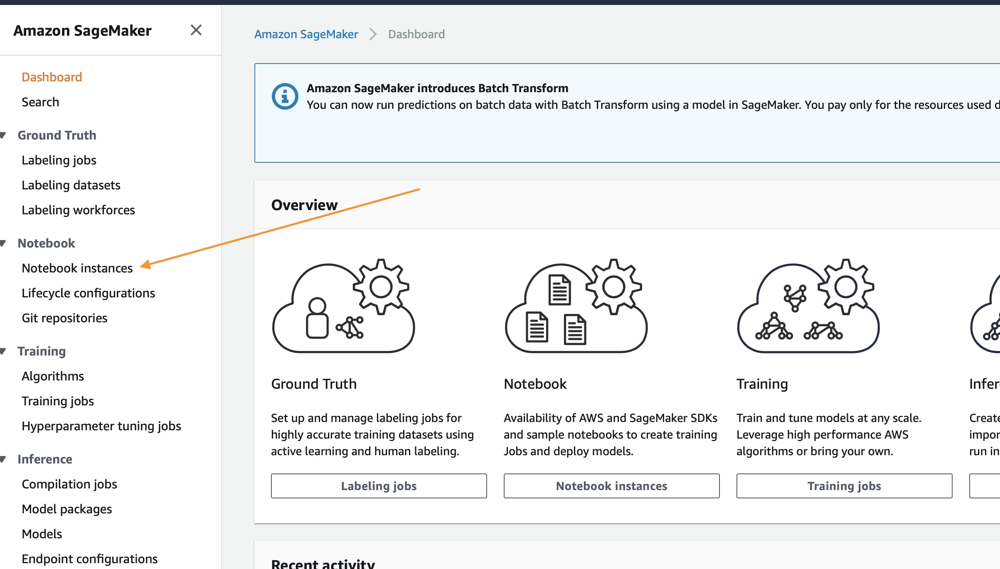

# Démarrage

Le tutoriel ci-dessous vous guidera dans la création d'un environnement de création d'un jeu de données, d'un modèle et d'une campagne de recommandation personnalisés avec Amazon Personalize. Si vous avez des problèmes avec l'un des contenus ci-dessous, veuillez ouvrir un ticket ici dans le référentiel.

## Conditions préalables

Ne s'applique que si vous déployez avec le modèle CloudFormation. Autrement, reportez-vous aux autorisations IAM nécessaires à votre tâche.

1. Compte AWS
2. Utilisateur ayant un accès administrateur au compte AWS

## Re:Invent 2019

Si vous organisez cet atelier pour Re:Invent 2019, cliquez simplement sur le bouton « Launch Stack » ci-dessous. Exécutez votre Instance Jupyter Notebook, et ouvrez le dossier « getting_started » et `ReInvent2019_Workshop.ipynb` !

Suivez les captures d'écran si vous avez des questions sur ces étapes.

### Assistant de Cloud Formation

Commencez par cliquer sur `Next` en bas comme indiqué :

Sur la page suivante, vous devez fournir un nom de compartiment S3 unique pour votre stockage de fichiers. Il est recommandé d'ajouter simplement votre prénom et votre nom à la fin de l'option par défaut comme indiqué ci-dessous. Après cette mise à jour, cliquez à nouveau sur `Next`.

Cette page est un peu plus longue. Faites donc défiler la page jusqu'en bas pour cliquer sur `Next`.

Encore une fois, faites défiler vers le bas, cochez la case pour permettre au modèle de créer de nouvelles ressources IAM, puis cliquez sur `Create Stack`.

Pendant quelques minutes, CloudFormation créera les ressources décrites ci-dessus en votre nom ; ce processus ressemblera à ceci pendant le provisionnement :

Une fois terminé, vous verrez un texte vert comme ci-dessous indiquant que le travail est achevé :

## Ordre du jour

Les étapes ci-dessous décrivent le processus de création de votre propre modèle de recommandation, son amélioration, puis le nettoyage de toutes vos ressources afin d'éviter toute charge non désirée. Pour commencer à les exécuter, suivez les étapes de la section suivante.

1. `ReInvent2019_Workshop.ipynb`  - Vous guide dans la création de votre première campagne et de votre algorithme de recommandation.

## Utilisation des blocs-notes

Commencez par vous rendre sur la page du service SageMaker en cliquant sur le lien `Services` dans la barre de navigation supérieure de la console AWS.

Dans le champ de recherche, saisissez `SageMaker` puis cliquez sur le service lorsqu'il apparaît. Sur la page du service, cliquez sur le lien `Notebook Instances` situé à l'extrême gauche de la barre de menu.

Pour accéder à l'interface Jupyter, il suffit de cliquer sur `Open JupyterLab` à l'extrémité droite à côté de votre instance de bloc-notes.

Vous serez redirigé vers le système Jupyter quelques secondes après avoir cliqué sur le lien ouvert. Toutefois, une fois dans le système, vous devriez voir une collection de fichiers sur votre gauche. Démarrez en cliquant sur `1.Building_Your_First_Campaign.ipynb`.

Le reste des analyses se déroulera par l'intermédiaire des blocs-notes Jupyter. Il suffit de lire chaque bloc avant de l'exécuter et de passer au suivant. Si vous avez des questions sur la façon d'utiliser les blocs-notes, demandez à votre instructeur. Si vous travaillez de façon autonome, cette vidéo est très utile pour commencer :

https://www.youtube.com/watch?v=Gzun8PpyBCo

## Après le bloc-notes

Une fois que vous avez terminé tous les travaux se trouvant dans les blocs-notes et que vous avez aussi terminé les étapes de nettoyage, la dernière chose à faire est de supprimer la pile que vous avez créée avec CloudFormation. Pour ce faire, à l'intérieur de la console AWS, cliquez à nouveau sur le lien `Services` en haut. Cette fois, saisissez `CloudFormation` et cliquez sur le lien pour cela.

Cliquez sur le bouton `Delete` de la pile de démonstration que vous avez créée :

Enfin, cliquez sur le bouton `Delete Stack` qui s'affiche dans la fenêtre contextuelle :

Vous remarquerez maintenant que la pile est en cours de suppression. Une fois que vous voyez `Delete Completed`, sachez que tout a été supprimé et que vous avez terminé complétement l'atelier.

