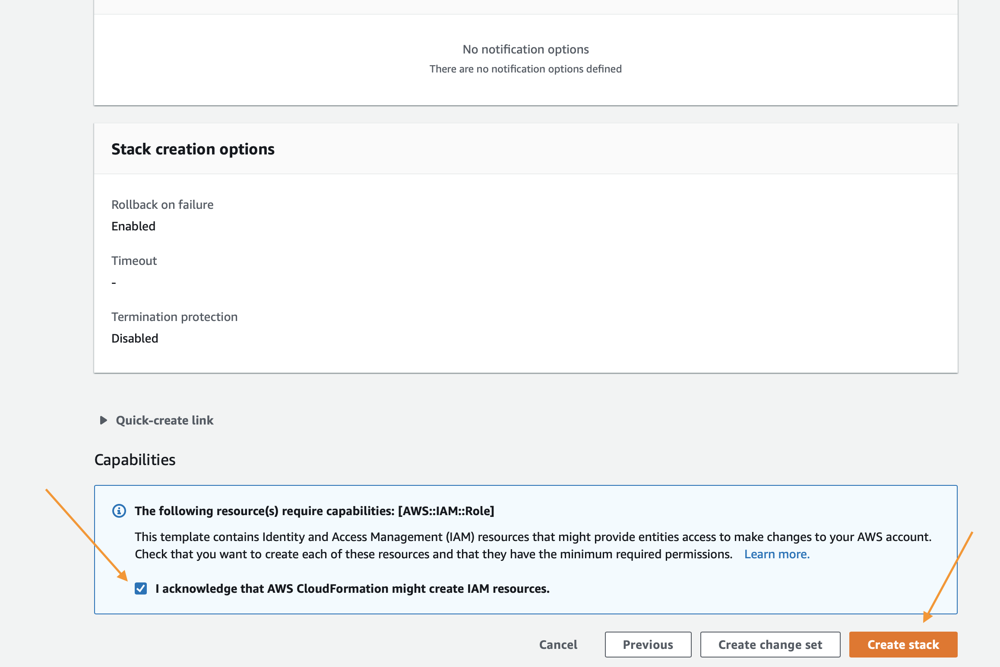
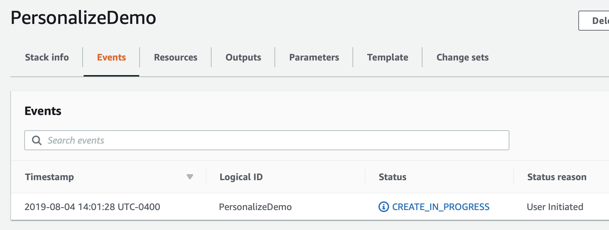

# Créer votre propre système de recommandation de films
Ce didacticiel vous guide à travers la création de votre propre système de recommandation de films.
Vous verrez comment vous pouvez créer des ressources dans Amazon Personalize qui génèrent des recommandations, tout comme la Magic Movie Machine !

## Présentation du didacticiel
Compléter ce didacticiel implique les étapes suivantes :

1. Suivez les instructions de ce fichier pour créer votre environnement et trouver les blocs-notes dans AWS Sagemaker. Cela implique le déploiement d'une pile AWS CloudFormation qui configure l'environnement de bloc-notes pour vous.
2. Exécutez le bloc-notes `Building_the_Magic_Movie_Machine_Recommender.ipynb` sur AWS Sagemaker. Vous avez déployé ce bloc-notes à l'étape 1. Ce bloc-notes vous guide dans la création de vos premiers systèmes de recommandation de films et l'obtention de vos premières recommandations.
3. Ouvrez le `Clean_Up_Resources.ipynb`. Ce bloc-notes supprime tout ce qui a été créé dans le bloc-notes précédent afin que vous ne soyez pas facturé pour des ressources supplémentaires.
4. Supprimez la pile AWS CloudFormation pour effacer les ressources d'environnement que vous avez créées à l'étape 2.

*Remarque* : Vous pouvez explorer le bloc-notes directement dans github. Cependant, pour bien l'exécuter, vous devez suivre les étapes ci-dessous pour déployer le bloc-notes dans un environnement préconfiguré.

## Créer votre environnement 
Avant de pouvoir créer votre propre système de recommandation de films, vous devez créer un environnement de travail comme suit :

1. Assurez-vous que vous avez satisfait aux conditions préalables environnementales énumérées ci-dessous.
2. Déployez la pile AWS CloudFormation.
3. Accéder à la console Amazon SageMaker

### Conditions préalables pour l'environnement

Pour effectuer le déploiement avec le modèle CloudFormation, vous devez disposer des éléments suivants.

1. Un compte AWS
2. Un utilisateur disposant d'un accès administrateur au compte AWS

### Déploiement de l'environnement

La première étape consiste à déployer un modèle CloudFormation qui effectuera une grande partie de la configuration initiale pour vous. Dans une autre fenêtre du navigateur, connectez-vous à votre compte AWS. Une fois que cela est fait, ouvrez le lien ci-dessous dans un nouvel onglet pour lancer le processus de déploiement des articles dont vous avez besoin à partir de CloudFormation.

Suivez les captures d'écran ci-dessous si vous avez des questions sur ces étapes.

  
Cliquer pour développer les instructions

  
### En utilisant l'assistant AWS CloudFormation,

commencez par cliquer sur « Suivant » en bas comme indiqué :

Sur la page suivante, vous devez fournir un nom de compartiment S3 unique pour votre stockage de fichiers. Il est recommandé d'ajouter simplement votre prénom et votre nom de famille à la fin de l'option par défaut comme indiqué ci-dessous. Après cette mise à jour, cliquez à nouveau sur « Suivant ».

Cette page étant un peu plus longue, faites-la défiler jusqu'en bas pour cliquer sur « Suivant ».

Faites défiler à nouveau jusqu'en bas, cochez la case pour permettre au modèle de créer de nouvelles ressources IAM, puis cliquez sur « Créer une pile ».

Pendant quelques minutes, CloudFormation créera les ressources décrites ci-dessus en votre nom ; ce processus ressemblera à ceci pendant le provisionnement :

Une fois terminé, vous verrez un texte vert comme ci-dessous indiquant que le travail est achevé :

Maintenant que vous avez créé votre environnement, vous devez enregistrer le nom de votre compartiment S3 pour une utilisation future. Pour le trouver, cliquez sur l'onglet « Résultats » et recherchez la ressource « S3Bucket ». Une fois que vous l'avez trouvée, copiez-la et collez-la dans un fichier texte pour le moment.

### Utilisation des blocs-notes

Commencez par naviguer vers la [page](https://console.aws.amazon.com/sagemaker/home) d'accueil Amazon SageMaker. À partir de la page du service, cliquez sur le lien `Notebook Instances` dans la barre de menus située à l'extrémité gauche.

Pour accéder à l'interface Jupyter, il suffit de cliquer sur `Open JupyterLab` à l'extrémité droite à côté de votre instance de bloc-notes.

Vous serez redirigé vers le système Jupyter quelques secondes après avoir cliqué sur le lien ouvert. Toutefois, une fois dans le système, vous devriez voir une collection de fichiers sur votre gauche.

Pour démarrer, accédez au dossier next_steps > workshops > magic_movie_machine > notebooks > Building the Magic Movie Machine Recommender.pynb

`amazon-personalize-samples/next_steps/workshops/magic_movie_machine/notebooks/Building the Magic Movie Machine Recommender.ipynb`

Assurez-vous de choisir un noyau qui utilise Python 3.x (le nom du noyau se terminera par p3x) avant de faire des analyses. Le reste des analyses se déroulera par l'intermédiaire des blocs-notes Jupyter. Il suffit de lire chaque bloc avant de l'exécuter et de passer au suivant. Si vous avez des questions sur la façon d'utiliser les blocs-notes, voici une très bonne vidéo pour vous lancer :

https://www.youtube.com/watch?v=Gzun8PpyBCo

## Suppression des ressources d'environnement

Une fois que vous avez terminé tous les travaux se trouvant dans les blocs-notes et que vous avez aussi terminé les étapes de nettoyage, la dernière chose à faire est de supprimer la pile que vous avez créée avec CloudFormation. Pour ce faire, à l'intérieur de la console AWS, cliquez à nouveau sur le lien `Services` en haut. Cette fois, saisissez `CloudFormation` et cliquez sur le lien pour cela.

Cliquez sur le bouton `Delete` de la pile de démonstration que vous avez créée :

Enfin, cliquez sur le bouton `Delete Stack` qui s'affiche dans la fenêtre contextuelle :

Vous remarquerez maintenant que la pile est en cours de suppression. Une fois que vous voyez `Delete Completed`, sachez que tout a été supprimé et que vous avez terminé complétement l'atelier.

