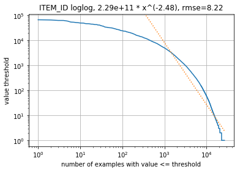

진단/데이터 시각화 도구
===
데이터 세트에 데이터 또는 항목 특성 누락과 같은 명백한 문제가 있는지 살펴보려면 [diagnose.py](diagnose.py)를 사용하세요. 
diagnose.py 사용 방법을 보여주는 예가 [example_ml_100k.ipynb](example_ml_100k.ipynb), [example_ml_1m.ipynb](example_ml_1m.ipynb), [example_ml_20m.ipynb](example_ml_20m.ipynb)에 나와 있습니다.

상호 작용 테이블의 몇 가지 예제 출력에 대해 설명합니다. 또한 이 도구는 비슷한 방법으로 사용자 및 항목 테이블을 검사합니다.

상호 작용 테이블, 원래 모양=(20000263, 4)
---

먼저, 상호 작용 테이블에서 누락된 데이터와 중복된 데이터를 확인합니다. 모든 필드에 많은 상호 작용과 미미한 수준(10% 미만)의 누락된 데이터가 있을 것으로 예상됩니다. 중복된 모든 데이터(USER_ID, ITEM_ID, TIMESTAMP)는 시스템에 의해 삭제됩니다.
```
missing rate in fields ['USER_ID', 'ITEM_ID', 'TIMESTAMP'] 0.0
dropna shape (20000263, 4)
duplication rate 0.0
drop_duplicates shape (20000263, 4)
```
또한 사용자 기록 전반에 걸쳐 반복되는 사용자-항목 활동도 확인합니다. 높은 반복률(50% 초과)은 일반적으로 사용자 기록이 길다는 것을 시사하며, 마지막 상호 작용만 유지하거나(다른 모든 상호 작용 삭제) 계층적 모델(TODO)을 사용하는 것이 유리할 수 있습니다.
```
user item repeat rate 0.0
```

상호 작용 테이블 설명
---

모든 데이터 열마다 주요 통계에 대한 설명을 보고합니다. 
수치 변수의 경우 다양성/독립성이 충분하다는 것은 일반적으로, 변수가 학습 작업에 덜 유용한 영향 계수가 아니라 모델에 활용할 수 있는 원인 계수일 수 있음을 나타내는 좋은 징후입니다.

ITEM_ID 같은 범주형 열의 경우, 멱승법 함수에 고유한 범주의 계수 분포에 멱승법 함수를 추가로 맞춥니다. 
임계값보다 크거나 같은 값을 가진 범주의 수를 기준으로 계수 임계값을 표시합니다. 
로그-로그 도표의 직선은 임계값의 상대적 변화로 인해, 임계값보다 큰 범주 수에서 그에 비례하는 상대적 변화가 발생한다는 것을 의미합니다.



로그-로그 공간의 적합성에 대해 비율 계수(이 예의 경우 -2.48)와 제곱근 평균 오차(rmse)를 맞춥니다. 
계수는 음수여야 합니다.

   규모가 큰 계수(<-2)는 두터운 머리 분포를 나타냅니다. 즉, 활동이 매우 적은 수의 범주에 치우쳐 있습니다. 
   이 예에서는 범주의 커버리지에 주목해야 합니다. 예를 들어 기존 시스템에 개인화되지 않은 레이아웃이 있고 위치 편향으로 인해 상위 몇 항목이 자주 클릭되는 경우 ITEM_ID 카운트가 몇 가지 범주에 치우칠 수 있습니다. 
   모델에 위치 컨텍스트를 포함하면 결과를 다양화하여 개인화가 개선될 수 있습니다.

   크기가 작은 계수(>-0.5)는 두터운 꼬리 분포를 나타냅니다. 즉, 카운트가 보다 균일합니다. 
   균일한 ITEM_ID 분포는 활동 간의 상관관계를 고려하지 않는다는 점에서 좋은 결과일 수 있습니다. 
   사용자/항목 기반 추천을 통해, 과거 항목을 사용하여 미래에 추천되는 ITEM_ID의 수를 줄일 수 있음을 알 수 있습니다.

개인화를 통한 이러한 모든 수정 사항은 최대 한도까지 적용할 수 있습니다. 
AWS에서는 모델링 기능의 한도에 대한 매우 일반적인 추정치에 해당하는 경고 지침을 게시하고 있습니다. 
특정 사용 사례에서는 이 같은 지침이 맞지 않을 수 있습니다. 따라서 주의해서 사용하세요.

시간축 이동 분석
---

새로운 콘텐츠가 빠르게 생성되고 이전 콘텐츠가 더 이상 적용되지 않게 되는 동적인 환경에서 추천이 이루어집니다. 
이 같은 상황에서는 새로운 정보로 추천 시스템을 자주 재훈련해야하고, 하드 임계값이 아닌 경우 recency_mask로 이전 예제에 가중치를 다시 부여해야 한다는 두 가지 문제가 발생합니다.

다음 재훈련 빈도 분석에서는 각각 같은 기간의 부트스트랩 인기도와 지난 기간의 인기도를 사용하여 각 기간의 항목 인기도 주변 분포를 예측하는 것을 목표로 합니다. 
모든 데이터 포인트는 모든 기간에 걸친 지정된 빈도에서의 가중 평균입니다. 
떨어진 인기도로 인해 같은 기간 부트스트랩보다 손실이 훨씬 클 경우 재훈련이 수행되어야 합니다. 
이 그래프에서 최적의 재훈련 빈도는 월 1회 이상입니다(Movielens는 설문조사 데이터 세트이므로 콘텐츠의 변화가 느림).


마찬가지로, 다음 시간축 이동 분석에서는 과거 X 기간의 연속 기록을 사용하여 다음 기간의 항목 주변 분포를 예측하는 것을 목표로 합니다. 
이 분석에서는 활동 밀도를 기준으로 가중 평균을 계산하지만 명확성을 높이기 위해 마지막 100개 포인트만 표시합니다. 
최적의 구성은 기록 데이터의 하드 임계값 또는 최근 가중치의 반감기(TODO)로 설정해야 합니다. 
이 예에서 최적의 기록 보존 기간은 지난 50일입니다. 
하지만 Personalize 솔루션에는 이미 recency_mask가 내장되어 있으므로, 잘 모르는 경우 더 긴 사용자 기록을 유지하는 것이 좋습니다.


여기서 고려하는 주요 손실은 총 변이(TV) 손실이지만, 부분적으로 큰 TV 손실의 원인이 되는 샘플 외 항목으로 인한 트래픽 손실의 비율도 포함합니다. 
샘플 외 항목으로 인해 손실이 큰 고객의 경우 [COLD-START 레시피](../personalize_temporal_holdout/personalize_coldstart_demo.ipynb)를 사용할 수 있습니다.


세션 시간 델타 설명
---

긴 기록이 있는 사용자의 경우 사용자 기록을 짧은 세션으로 그룹화하면 유용할 수 있으며, 사용자는 각 세션 동안 유사한 관심사를 유지하는 경향이 있습니다. 
시간 델타를 사용하여 세션 시작(BoS) 신호를 결정합니다. 
연구 논문[1]은 이러한 신호가 추천 품질을 크게 높인다는 것을 보여줍니다. 
다음 도표는 모든 인접한 활동 쌍 사이의 시간-델타의 멱승법 분포를 보여 줍니다.


이 도표에서 모든 시간 델타 중 10% 미만이 1분 간격을 초과하고, 1% 미만이 1개월 간격을 초과한다는 것을 확인할 수 있습니다. 
세션 임계값을 1분으로 설정하면 세션 간 수준에서 10%의 BoS 신호가 구해집니다. 
USER_ID 멱승법 도표와 함께, 이는 사용자의 활동 기록에서 세션 처리량이 평균 10개임을 나타냅니다.

참고로 Movielens 데이터 세트는 영화 설문조사 웹 사이트에서 가져온 것인 만큼 세션 임계값이 다소 짧습니다. 
다른 유형의 데이터 세트는 일반적으로 BoS 임계값이 더 크고 분산되어 있으며, 이 경우 다중 세션 계층(TODO)을 추가로 정의할 수 있습니다.

#### 참고 문헌
[1] Yifei Ma, Balakrishnan (Murali) Narayanaswamy. Hierarchical Temporal-Contextual Recommenders. 시공간 도메인의 모델링 및 의사 결정에 대한 NIPS 2018 워크숍. [링크](https://openreview.net/forum?id=ByzxsrrkJ4)
