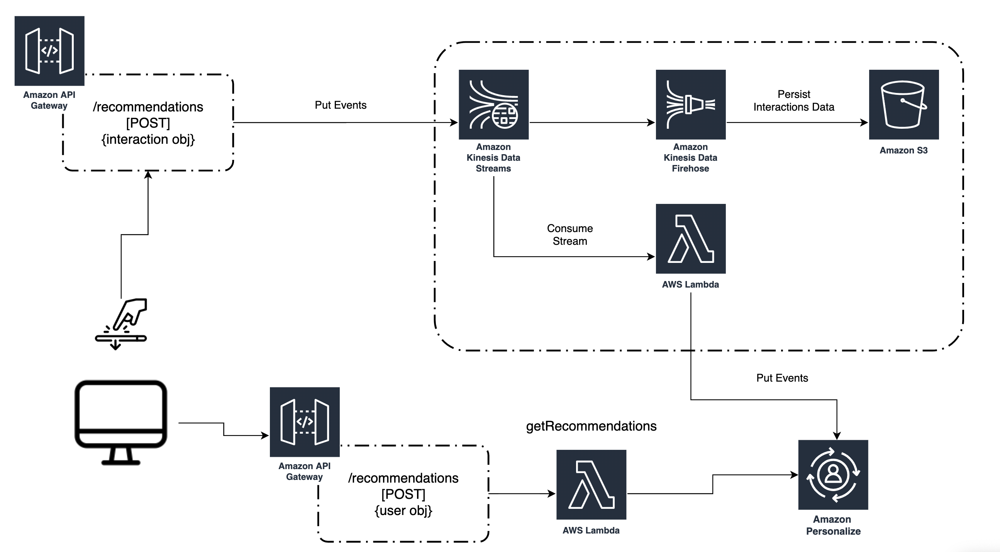

# 시작하기

이 예에서는 Amazon Personalize 추천을 소비하고 실시간 이벤트를 생성하는 API 계층을 구성하는 데 사용할 수 있는 핵심 요소를 보여 줍니다.

아래에서 보듯이, 이 프로젝트에서 구현할 아키텍처는 이와 같습니다.



**참고:** 이 튜토리얼을 완료하려면 사전에 Amazon Personalize 캠페인 및 이벤트 트래커를 별도로 배포해야 합니다. MLOps 폴더에 있는 다음 자동화 예제를 사용하거나 시작 폴더를 활용하여 Amazon Personalize 캠페인을 배포할 수 있습니다.

## 사전 요구 사항

### AWS SAM 설치

AWS Serverless Application Model(SAM)은 서버리스 애플리케이션을 구축하기 위한 오픈 소스 프레임워크로, 함수, API, 데이터베이스 및 이벤트 소스 매핑을 나타내는 단축 구문을 제공합니다. 리소스 하나당 코드 몇 줄로 원하는 애플리케이션을 정의하고 YAML을 사용하여 모델링할 수 있습니다. 배포 중에 SAM은 SAM 구문을 AWS CloudFormation 구문으로 변환 및 확장하여 서버리스 애플리케이션을 더 빨리 구축할 수 있도록 합니다.

[AWS SAM CLI](https://docs.aws.amazon.com/serverless-application-model/latest/developerguide/serverless-sam-cli-install.html)를 **설치**합니다. 
그러면 프로젝트를 빌드하고, 배포하고. 로컬로 테스트하는 데 필요한 도구가 설치됩니다. 이 예에서는 빌드하고 배포하는 데에만 AWS SAM을 사용합니다. 자세한 내용은 [설명서](https://docs.aws.amazon.com/serverless-application-model/latest/developerguide/what-is-sam.html)를 참조하세요.

### Personalize 구성 요소 생성 

시작하기 [지침](https://github.com/aws-samples/amazon-personalize-samples/tree/master/getting_started)을 따른 후, Amazon Personalize 캠페인을 **생성**하고 거기에 이벤트 트래커를 연결합니다.

또한 이 MLOps [예제](https://github.com/aws-samples/amazon-personalize-samples/tree/master/next_steps/operations/ml_ops)를 활용하여 이 부분을 자동화할 수도 있습니다.

## 빌드 및 배포

프로젝트를 배포하려면 다음 명령을 실행해야 합니다.

1. Amazon Personalize 샘플 리포지토리 복제
    - `git clone https://github.com/aws-samples/amazon-personalize-samples.git`
2. *next_steps/operations/streaming_events* 디렉터리로 이동합니다.
    - `cd amazon-personalize-samples/next_steps/operations/streaming_events`
3. SAM 프로젝트를 빌드합니다. [설치 지침](https://docs.aws.amazon.com/serverless-application-model/latest/developerguide/serverless-sam-cli-install.html)
    - `sam build`
4. 프로젝트를 배포합니다. SAM은 안내에 따라 배포할 수 있는 배포 옵션을 제공합니다. 알림을 받으려면 이메일 주소를 파라미터로 제공해야 합니다.
    - `sam deploy --guided`
5. 이벤트 데이터를 저장할 S3 버킷, Personalize 캠페인 ARN 및 이벤트 트래커 ID를 입력합니다.

## 엔드포인트 테스트

- Amazon CloudFormation [콘솔](https://console.aws.amazon.com/cloudformation/home?region=us-east-1)로 이동
- SAM이 배포한 스택 선택
- 출력 섹션으로 이동하여 엔드포인트 2개와 API 키를 찾음:
    1. POST getRecommendations 엔드포인트
    2. POST Events 엔드포인트
    3. 키 표시(Show Key) 섹션을 클릭해 API 키를 표시할 수 있는 API Gateway 콘솔로 리디렉션

PostMan 또는 유사한 도구를 사용하는 경우 다음과 같은 헤더를 제공해야 합니다.
`x-api-key: <YOUR API KEY VALUE>`

**POST getRecommendations 예제:**

Body 파라미터:
```
{
    "userId":"12345"
    
}
```

*엔드포인트:* `https://XXXXXX.execute-api.us-east-1.amazonaws.com/dev2/recommendations`


**POST 이벤트 예제**

POST 엔드포인트의 경우 요청의 body에서 다음과 유사한 이벤트를 전송해야 합니다.

*엔드포인트:* `https://XXXXXX.execute-api.us-east-1.amazonaws.com/dev2/history`

Body:
```
{
    "Event":{
        "itemId": "ITEMID",
        "eventValue": EVENT-VALUE,
        "CONTEXT": "VALUE" //optional
    },
    "SessionId": "SESSION-ID-IDENTIFIER",
    "EventType": "YOUR-EVENT-TYPE",
    "UserId": "USERID"
}
```

## 요약

이제 계정에 이 아키텍처가 있으므로, API Gateway POST 추천 엔드포인트를 통해 Amazon Personalize 추천을 소비하고 실시간 상호 작용 데이터를 POST 이벤트 엔드포인트로 스트리밍할 수 있습니다.

이 아키텍처에는 두 가지 추가 기능이 있습니다.

- Kinesis 스트림에서 지속된 이벤트가 포함된 S3 버킷. Glue 및 Athena와 같은 다른 AWS 서비스를 사용하여 이 버킷에 대한 분석을 실행할 수 있습니다. 예를 들어 이 [블로그](https://aws.amazon.com/blogs/big-data/build-and-automate-a-serverless-data-lake-using-an-aws-glue-trigger-for-the-data-catalog-and-etl-jobs/)에서 ETL 파이프라인을 자동화하는 방법을 참조할 수 있습니다.


## 다음 단계

축하합니다! Amazon Personalize 배포와 관련한 API 계층을 배포하고 테스트했습니다.

추천을 받는 방법에 대한 자세한 내용은 [설명서](https://docs.aws.amazon.com/personalize/latest/dg/getting-recommendations.html)를 참조하세요.
