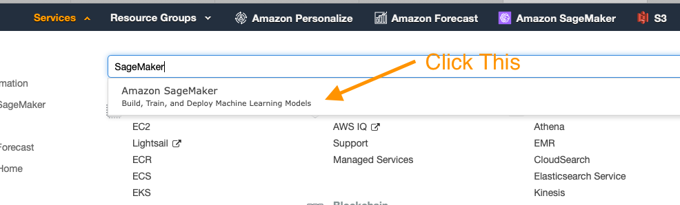

## Amazon Personalize Immersion Day

이 Immersion Day의 목표는 [Amazon Personalize](https://aws.amazon.com/personalize/)의 다양한 기능을 사용하는 방법을 익히기 위한 공통의 출발점을 제공하는 것입니다.

여기서 언급된 개념에 대한 자세한 내용은 [Personalize 개발자 가이드](https://docs.aws.amazon.com/personalize/latest/dg/what-is-personalize.html)를 참조하세요.

이 노트북에서 배울 내용은 다음과 같습니다.

1. Amazon Personalize에 사용할 데이터 세트를 준비합니다.
1. 해당 데이터 세트를 기반으로 모델을 구축합니다.
1. 실제 관측 결과를 기준으로 모델의 성능을 평가합니다.

## 진행 순서

아래의 절차에서는 고유한 시계열 예측 모델을 구축하고 평가한 다음, 원치 않는 요금이 발생하지 않도록 모든 리소스를 정리하는 프로세스를 간략하게 설명합니다. 시작하려면 다음 단계를 실행합니다.

1. 아래의 CloudFormation 템플릿을 배포하거나, AWS CLI를 설치하고 IAM 계정에 대해 구성한 로컬 Jupyter 환경을 구축합니다.
1. 이 [personalize_hrnn_metadata_contextual_example.ipynb](personalize_hrnn_metadata_contextual_example.ipynb)는 이 같은 유용한 정보를 시스템에 업로드하여 추천을 지원하는 방법을 보여줍니다. 주의할 점은 제공된 메타데이터에서 얼마나 많은 정보를 추출할 수 있는지에 따라 메타데이터 레시피가 얼마나 향상될지 결정된다는 것입니다.

## 사전 요구 사항 

1. AWS 계정
1. 관리 권한이 있는 계정의 사용자

## 개요

1. 먼저 데이터 스토리지로 사용할 S3 버킷을 생성하는 CloudFormation 템플릿, 연습을 실행할 SageMaker 노트북 인스턴스, 노트북 인스턴스용 IAM 정책을 배포합니다. 그러면 이 리포지토리가 노트북 인스턴스에 복제되어 시작할 준비가 됩니다.
1. 그런 다음, `personalize_hrnn_metadata_contextual_example.ipynb`를 열어 시작합니다.
1. 이 노트북은 평가를 마치고 잘 작동하는 Amazon Personalize가 준비될 때까지 다른 노트북의 프로세스를 안내합니다.

## 환경 구축:

위에서 언급한 바와 같이, 첫 단계는 초기 설정 작업의 대부분을 수행할 CloudFormation 템플릿을 배포하는 것입니다. 다른 브라우저 창이나 탭에서 AWS 계정에 로그인합니다. 그런 다음, 아래 링크를 새 탭에서 열고 CloudFormation을 통해 필요한 항목을 배포하는 프로세스를 시작합니다.

스택을 배포하는 방법을 잘 모르겠으면, 아래의 스크린샷을 따르세요.

### CloudFormation 마법사

다음과 같이 하단에서 `Next`를 클릭하여 시작합니다.

이 페이지에는 다음과 같은 몇 가지 작업이 있습니다.

1. 스택 이름을 다음과 같이 연관성이 있는 이름으로 변경합니다.`PersonalizeImmersionDay`
1. 노트북 이름 변경(선택 사항)
1. SageMaker EBS 볼륨의 볼륨 크기를 변경합니다. 기본값은 10GB입니다. 데이터 세트가 더 클 것으로 예상되면 그에 따라 볼륨 크기를 늘리세요.

작업을 마쳤으면 하단에서 `Next`를 클릭합니다.

이 페이지는 조금 길기 때문에 아래까지 스크롤하여 `Next`를 클릭하세요. 모든 기본값을 사용해도 POC를 충분히 완료할 수 있지만, 사용자 지정 요구 사항이 있는 경우 필요에 따라 변경합니다.

다시 하단으로 스크롤하고 템플릿을 사용하여 새 IAM 리소스를 생성할 수 있도록 확인란을 선택한 다음 `Create Stack`을 클릭합니다.

몇 분 동안 CloudFormation이 자동으로 위에서 설명하는 리소스를 생성합니다. 프로비저닝하는 동안 다음과 같이 표시됩니다.

이 작업이 완료되면 다음과 같은 녹색 텍스트가 나타나 작업이 완료되었음을 나타냅니다.

이제 환경이 생성되었으므로, 콘솔 상단의 `Services`를 클릭한 다음 `SageMaker`를 검색하고 해당 서비스를 클릭하여 SageMaker의 서비스 페이지로 이동합니다.

SageMaker 콘솔에서 현재 여러 노트북을 사용 중임을 나타내는 녹색 상자가 나타날 때까지 스크롤한 다음 그 상자를 클릭합니다.

이 페이지에는 실행 중인 SageMaker 노트북 목록이 표시됩니다. 새로 생성한 Personalize POC 노트북의 `Open JupyterLab` 링크를 클릭합니다.

이렇게 하면 POC를 위한 Jupyter 환경이 열립니다. Jupyter 환경이 익숙하지 않은 경우, 웹 기반 데이터 과학 IDE라고 생각하면 됩니다.

왼쪽에서 다음 디렉터리 `amazon-personalize-samples/workshops/Immersion_Day/`로 이동한 후 `personalize_hrnn_metadata_contextual_example.ipynb` 노트북을 두 번 클릭합니다.