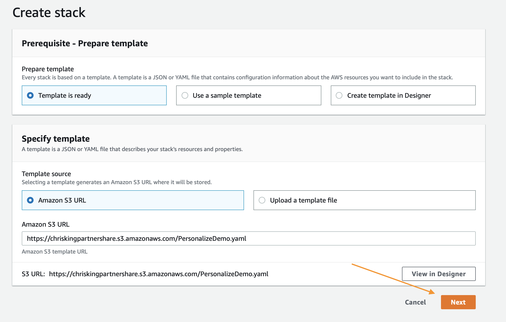

# 시작하기

아래의 튜토리얼에서는 Amazon Personalize로 사용자 지정 데이터 세트, 모델 및 추천 캠페인을 만들기 위한 환경을 구축하는 과정을 안내합니다. 아래 콘텐츠를 진행하는 데 문제가 있는 경우 리포지토리에서 문제를 제기하세요.

## 사전 요구 사항

이 콘텐츠는 CloudFormation 템플릿을 사용하여 배포하는 경우에만 적용됩니다. 그 외의 경우에는 특정 작업에 필요한 IAM 권한을 참조하세요.

1. AWS 계정
2. AWS 계정에 대한 관리자 권한이 있는 사용자

## re:Invent 2019

re:Invent 2019용으로 이 워크숍을 제작하는 경우 아래의 스택 시작(Launch Stack) 버튼을 클릭하면 됩니다. Jupyter 노트북 인스턴스를 실행하고 ‘getting_started’ 폴더와 `ReInvent2019_Workshop.ipynb`를 엽니다.

이 단계를 잘 모르겠으면, 스크린샷을 따르세요.

### CloudFormation 마법사

다음과 같이 하단에서 `Next`를 클릭하여 시작합니다.

다음 페이지에서는 파일 스토리지에 고유한 S3 버킷 이름을 지정해야 합니다. 아래에 나와 있는 기본 옵션의 끝에 사용자의 이름과 성을 추가하는 것이 좋습니다. 업데이트한 후 `Next`를 다시 클릭합니다.

이 페이지는 조금 길기 때문에 아래까지 스크롤하여 `Next`를 클릭하세요.

다시 하단으로 스크롤하고 템플릿을 사용하여 새 IAM 리소스를 생성할 수 있도록 확인란을 선택한 다음 `Create Stack`을 클릭합니다.

몇 분 동안 CloudFormation이 자동으로 위에서 설명하는 리소스를 생성합니다. 프로비저닝하는 동안 다음과 같이 표시됩니다.

이 작업이 완료되면 다음과 같은 녹색 텍스트가 나타나 작업이 완료되었음을 나타냅니다.

## 진행 순서

아래의 절차에서는 추천 모델을 구축하고 개선한 다음, 원치 않는 요금이 발생하지 않도록 모든 리소스를 정리하는 프로세스를 간략하게 설명합니다. 실행을 시작하려면 다음 섹션의 단계를 따릅니다.

1. `ReInvent2019_Workshop.ipynb`  - 첫 번째 캠페인 및 추천 알고리즘을 구축하는 과정을 안내합니다.

## 노트북 사용

먼저, AWS 콘솔의 상단 탐색 모음에서 `Services` 링크를 클릭하여 SageMaker 서비스 페이지로 이동합니다.

검색 필드에 `SageMaker`를 입력하고 해당 서비스가 나타나면 클릭한 후, 서비스 페이지의 맨 왼쪽에 있는 메뉴 표시줄에서 `Notebook Instances` 링크를 클릭합니다.

Jupyter 인터페이스로 이동하려면 노트북 인스턴스 옆의 맨 오른쪽에 있는 `Open JupyterLab`을 클릭합니다.

열려 있는 링크를 클릭하면 Jupyter 시스템으로 리디렉션되는 데 몇 초가 걸립니다. 이 시스템에 연결되면 왼쪽에 파일 모음이 표시됩니다. `1.Building_Your_First_Campaign.ipynb`를 클릭하여 시작합니다.

실습의 나머지 부분은 Jupyter 노트북을 통해 진행되며, 각 블록을 읽고 실행한 후 다음 블록으로 넘어갑니다. 노트북 사용 방법과 관련해 궁금한 점이 있으면 강사에게 문의하거나, 혼자 작업하는 경우에는 다음 동영상을 참조하여 시작할 수 있습니다.

https://www.youtube.com/watch?v=Gzun8PpyBCo

## 노트북 완료 후

노트북의 모든 작업을 완료하고 정리 단계도 완료했으면, 마지막으로 CloudFormation으로 만든 스택을 삭제합니다. 그러려면 AWS 콘솔에서 상단의 `Services` 링크를 다시 클릭하고, 이번에는 `CloudFormation`로 이동해 해당 서비스 링크를 클릭합니다.

생성한 데모 스택에서 `Delete` 버튼을 클릭합니다.

마지막으로 팝업에 표시되는 `Delete Stack` 버튼을 클릭합니다.

이제 스택이 삭제되는 중임을 알 수 있습니다. `Delete Completed`라고 표시되면 모든 항목이 삭제되고 이 실습이 100% 완료되었음을 알 수 있습니다.

