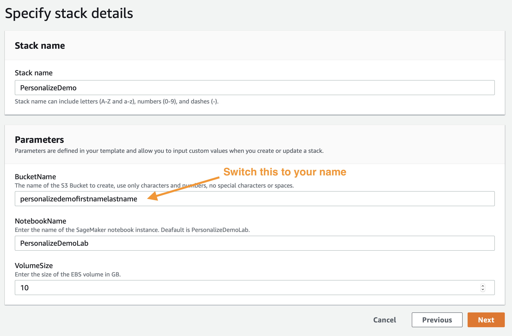

# 자신만의 영화 추천 시스템 만들기
이 튜토리얼에서는 자신만의 영화 추천 시스템을 만드는 과정을 안내합니다. 
Magic Movie Machine처럼 추천을 생성하는 리소스를 Amazon Personalize에서 만드는 방법을 참조할 수 있습니다.

## 튜토리얼 개요
이 튜토리얼을 완료하려면 다음 단계를 수행해야 합니다.

1. 이 파일의 지침에 따라 환경을 구축하고 AWS SageMaker에서 노트북을 찾습니다. 그러려면 노트북 환경을 설정하는 AWS CloudFormation 스택을 배포해야 합니다.
2. AWS SageMaker에서 `Building_the_Magic_Movie_Machine_Recommender.ipynb` 노트북을 실행합니다. 이 노트북은 1단계에서 배포했습니다. 이 노트북은 첫 번째 영화 추천 시스템을 구축하고 첫 번째 추천을 받는 과정을 안내합니다.
3. `Clean_Up_Resources.ipynb`를 실행합니다. 이 노트북은 이전 노트북에서 만든 모든 항목을 삭제하여 리소스 요금이 추가로 청구되지 않도록 합니다.
4. AWS CloudFormation 스택을 삭제하여 2단계에서 생성한 환경 리소스를 삭제합니다.

참고: 이 노트북은 Github에서 직접 탐색할 수 있습니다. 하지만 노트북을 성공적으로 실행하려면 다음 단계에 따라 미리 구성된 환경에 노트북을 배포해야 합니다.

## 환경 구축 
영화 추천 시스템을 구축하려면 먼저 다음과 같은 작업 환경을 구축해야 합니다.

1. 아래에 나열된 환경 사전 요구 사항을 충족하는지 확인합니다.
2. AWS CloudFormation 스택을 배포합니다.
3. Amazon SageMaker 콘솔로 이동합니다.

### 환경 사전 요구 사항

CloudFormation 템플릿을 사용하여 배포하려면 다음이 필요합니다.

1. AWS 계정
2. AWS 계정에 대한 관리자 권한이 있는 사용자

### 환경 배포

첫 단계는 초기 설정 작업의 대부분을 수행할 CloudFormation 템플릿을 배포하는 것입니다. 다른 브라우저 창에서 AWS 계정에 로그인합니다. 그런 다음, 아래 링크를 새 탭에서 열고 CloudFormation을 통해 필요한 항목을 배포하는 프로세스를 시작합니다.

이러한 단계를 수행하는 방법을 잘 모르겠으면, 아래의 스크린샷을 따르세요.

  
지침을 펼쳐 보려면 클릭하세요.

  
### AWS Cloud Formation 마법사

사용 아래에 나와 있는 것처럼 다음(`Next`)을 클릭하여 시작합니다. 

다음 페이지에서는 파일 스토리지에 고유한 S3 버킷 이름을 지정해야 합니다. 아래에 나와 있는 기본 옵션의 끝에 사용자의 이름과 성을 추가하는 것이 좋습니다. 업데이트한 후 다음(`Next`)을 다시 클릭합니다. 

이 페이지는 조금 길기 때문에 아래까지 스크롤하여 다음(`Next`)을 클릭하세요. 

다시 하단으로 스크롤하고 템플릿을 사용하여 새 IAM 리소스를 생성할 수 있도록 확인란을 선택한 다음 스택 생성(`Create Stack`)을 클릭합니다. 

몇 분 동안 CloudFormation이 자동으로 위에서 설명하는 리소스를 생성합니다. 프로비저닝하는 동안 다음과 같이 표시됩니다. 

이 작업이 완료되면 다음과 같은 녹색 텍스트가 나타나 작업이 완료되었음을 나타냅니다. 

이제 환경을 만들었으므로 나중에 사용할 수 있도록 S3 버킷의 이름을 저장해야 합니다. S3 버킷의 이름은 출력(`Outputs`) 탭을 클릭하고 `S3Bucket`이라는 리소스틀 찾으면 확인할 수 있습니다. S3 버킷의 이름을 찾으면 복사해서 텍스트 파일에 붙여 넣어 둡니다.

### 노트북 사용

먼저 Amazon SageMaker 랜딩 [페이지](https://console.aws.amazon.com/sagemaker/home)로 이동합니다. 서비스 페이지에서 맨 왼쪽 메뉴 표시줄의 `Notebook Instances` 링크를 클릭합니다.

Jupyter 인터페이스로 이동하려면 노트북 인스턴스 옆의 맨 오른쪽에 있는 `Open JupyterLab`을 클릭합니다.

열려 있는 링크를 클릭하면 Jupyter 시스템으로 리디렉션되는 데 몇 초가 걸립니다. 이 시스템에 연결되면 왼쪽에 파일 모음이 표시됩니다.

시작하려면 next_step 폴더 > workshops > magic_movie_machine > notebooks > Building the Magic Movie Machine Recommender.pynb로 이동합니다.

`amazon-personalize-samples/next_steps/workshops/magic_movie_machine/notebooks/Building the Magic Movie Machine Recommender.ipynb`

실습을 실행하기 전에 Python 3.x를 사용하는 커널(커널 이름이 p3x로 끝남)을 선택해야 합니다. 실습의 나머지 부분은 Jupyter 노트북을 통해 진행되며, 각 블록을 읽고 실행한 후 다음 블록으로 넘어갑니다. 노트북 사용 방법을 잘 모를 경우 다음 동영상을 참조하세요.

https://www.youtube.com/watch?v=Gzun8PpyBCo

## 환경 리소스 삭제

노트북의 모든 작업을 완료하고 정리 단계도 완료했으면, 마지막으로 CloudFormation으로 만든 스택을 삭제합니다. 그러려면 AWS 콘솔에서 상단의 `Services` 링크를 다시 클릭하고, 이번에는 `CloudFormation`로 이동해 해당 서비스 링크를 클릭합니다.

생성한 데모 스택에서 `Delete` 버튼을 클릭합니다.

마지막으로 팝업에 표시되는 `Delete Stack` 버튼을 클릭합니다.

이제 스택이 삭제되는 중임을 알 수 있습니다. `Delete Completed`라고 표시되면 모든 항목이 삭제되고 이 실습이 100% 완료되었음을 알 수 있습니다.

