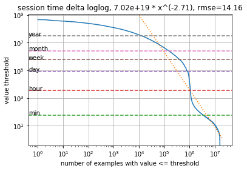

诊断/数据可视化工具
===
请使用 [diagnose.py](diagnose.py) 来探测数据集，以查找任何明显的问题，如缺少数据或项目特性。
关于如何使用 diagnose.py 的示例，可见于 [example_ml_100k.ipynb](example_ml_100k.ipynb)、[example_ml_1m.ipynb](example_ml_1m.ipynb)、[example_ml_20m.ipynb](example_ml_20m.ipynb)。

我们解释了来自交互表的一些示例输出。该工具还会以类似的方式检查用户和项目表。

交互表，original shape=(20000263, 4)
---

首先，我们检查交互表中的缺失数据和重复内容。我们预计所有字段中会有大量交互和少量（<10%）数据缺失。系统会删除（USER_ID、ITEM_ID、TIMESTAMP）中的所有重复部分。
```
missing rate in fields ['USER_ID', 'ITEM_ID', 'TIMESTAMP'] 0.0
dropna shape (20000263, 4)
duplication rate 0.0
drop_duplicates shape (20000263, 4)
```
我们还会检查整个用户历史记录中是否有重复的用户项目活动。高重复率（>50%）通常表明用户历史记录较长，考虑只保留最后的交互（放弃所有其他交互）或使用分层模型（TODO）可能会有好处。
```
user item repeat rate 0.0
```

描述交互表
---

每一个数据列，我们都会报告主要统计数据的说明。
对于数值变量，足够多样化/独立通常是一个好兆头，表明该变量可能是一个我们可以在模型中利用的原因因素，而非一个为我们的学习任务提供较少信息的影响因素。

对于分类列（如 ITEM_ID），我们针对唯一类别的计数分布另外拟合一个幂律函数。
我们根据值大于或等于阈值的类别数量绘制计数阈值。
双对数坐标图中的一条直线代表阈值的相对变化应导致阈值以上类别数量的比例相对变化。


我们拟合比例系数，本例中为 -2.48，以及在双对数空间中拟合优度的均方根误差（RMSE）。
系数须为负。

   系数较大（<-2）表示轻尾分布，即活动倾向于极少数类别。
   在这种情况下，我们应注意类别的覆盖范围。例如，当现有系统拥有非个性化布局时，ITEM_ID 计数可能会偏向几个类别，并且排名靠前的几个类别经常因为位置偏差而获点击。
   在模型中涵盖位置上下文可以使结果多样化，从而获得更好的个性化结果。

   系数较小（>-0.5）表示重尾分布，即计数非常统一。
   统一的 ITEM_ID 分布可能仍然是一个很好的示例，因为它没有考虑活动之间的相关性。
   可以预见，通过基于用户/项目的推荐，过去的项目可能会缩小未来要推荐的 ITEM_ID 的数量。

所有这些通过个性化进行的更正都有一个限度。
我们发布了警告指南，指明对建模能力限制的一般估计结果。
在特定用例中，这些指南可能是错误的。请谨慎使用。

时间转换分析
---

推荐发生在一个动态环境，新内容迅速产生，旧内容很快过时。
这带来了两个挑战：推荐器必须经常通过新信息进行再训练，并且必须使用 recency_mask 硬阈值或重新权衡旧示例。

以下再训练频率分析旨在分别利用同一时段启动的人气和上一时段的流行度来预测每个时段边际项的流行度分布。
每个数据点都是指定频率所有时段的加权平均值。
当人气滞后造成的损失比同期启动大得多时，就应该进行再训练。
在这个图中，最佳的再训练频率至少为每月一次（MovieLens 是一个调查数据集，所以内容较为滞后）。


同理，下面的时间转换分析旨在利用过去 X 个时段的滚动历史来预测下一个时段的边际项分布。
该分析按活动密度计算加权平均值，但为了清晰起见，只给出最后 100 个点。
最佳配置应设置为历史数据的硬阈值或新近加权半衰期（TODO）。
在本例中，最优历史记录保留时间是最近 50 天。
但是，Personalize 解决方案已内置 recency_mask，当有疑虑时，保留较长的用户历史记录是有好处的。


我们考虑的主要损失是总变差（TV）损失，但我们也包括了由于样本外项目造成的流量损失的百分比，这在一定程度上解释了产生较大 TV 损失的原因。
针对因样本外项目损失较大的客户，请考虑采用我们的 [COLD-START 配方](../personalize_temporal_holdout/personalize_coldstart_demo.ipynb)。


会话时间间隔说明
---

对于具有较长历史记录的用户，将用户历史记录分组为较短的会话通常会有帮助，在每个会话中用户往往保持着相似的兴趣。
我们使用时间间隔来确定会话开始（BoS）信号。
我们的研究论文 [1] 表明，这些信号显著提高了推荐质量。
下图显示了所有相邻活动对之间的时间间隔幂律分布。



从该图中我们可以看到，所有时间间隔中，有不到 10% 间隔超过 1 分钟，不到 1% 间隔超过 1 个月。
如果我们将会话阈值设置为 1 分钟，那么就只剩下 10% 的 BoS 信号处于会话间级别。
结合 USER_ID 幂律图，这表明用户活动历史中的平均会话吞吐量为 10 个。

顺便说一下，MovieLens 数据集的会话阈值相当短，因为它来自一个电影调查网站。
其他类型的数据集通常有更大、更分散的 BoS 阈值，其中我们可以额外定义多个会话层级结构（TODO）。

#### 参考资料
[1] Yifei Ma, Balakrishnan (Murali) Narayanaswamy. Hierarchical Temporal-Contextual Recommenders. NIPS 2018 Workshop on Modeling and Decision-Making in Spatiotemporal Domains. [链接](https://openreview.net/forum?id=ByzxsrrkJ4)
