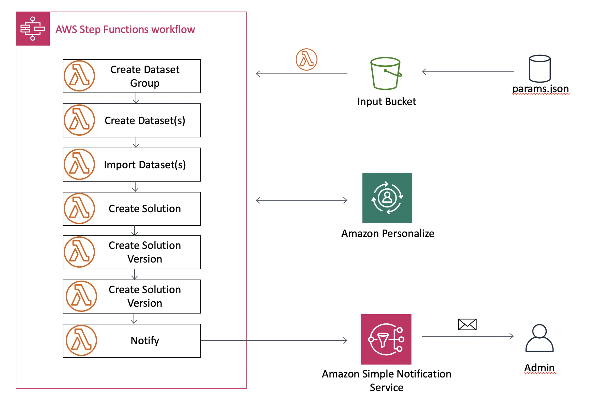
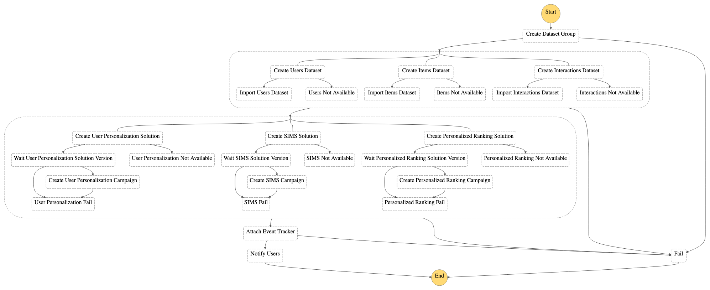

**这个示例已经被 AWS [用机器学习维护个性化体验](https://aws.amazon.com/solutions/implementations/maintaining-personalized-experiences-with-ml/)的解决方案所取代。此解决方案允许您自动化导入以下端到端流程：数据集、创建解决方案和解决方案版本、创建和更新广告活动、创建筛选器以及运行批量推理作业。这些流程可以按需运行，也可以根据您定义的时间表触发运行。**

# 入门指南

ML Ops 越来越受欢迎。这个示例展示了一个可以用来构建自动化流水线的关键部分。正如我们在下面的架构图中所看到的，您将部署一个 AWS Step Function 工作流，其中包含可调用 Amazon S3、Amazon Personalize 和 Amazon SNS API 的 AWS Lambda 函数。

此软件包包含一个 Step Functions 流水线的源代码，该流水线能够在 **Amazon Personalize** 中执行 
 多个操作，包括：

- 数据集组创建
- 数据集创建与导入
- 解决方案创建
- 解决方案版本创建
- 活动创建

完成这些步骤后，Step Functions 会通过
使用 SNS 主题通知用户已完成。

下图给出了该解决方案的架构：



下图展示了 StepFunction 工作流定义：



## 先决条件

### 安装 AWS SAM

AWS Serverless Application Model（SAM）是一个开源架构，用于构建无服务器应用程序。它提供简写语法来表示函数、API、数据库和事件源映射。每个资源仅需使用几行，就可以定义所需的应用程序并使用 YAML 对其建模。部署期间，SAM 会转换 SAM 语法并将该语法扩展为 AWS CloudFormation 语法，让您能够更快构建无服务器应用程序。

**安装** [AWS SAM CLI](https://docs.aws.amazon.com/serverless-application-model/latest/developerguide/serverless-sam-cli-install.html)。
这将安装构建、部署和本地测试项目所需的工具。在本例中，我们将只使用 AWS SAM 进行构建和部署。如需了解更多信息，请参见我们的[文档](https://docs.aws.amazon.com/serverless-application-model/latest/developerguide/what-is-sam.html)。

## 构建和部署

为了部署项目，您需要运行以下命令：

1. 复制 Amazon Personalize 样本存储库
    - `git clone https://github.com/aws-samples/amazon-personalize-samples.git`
2. 前往 *next_steps/operations/ml_ops/personalize-step-functions* 目录
    - `cd next_steps/operations/ml_ops/personalize-step-functions`
3. 构建您的 SAM 项目。[安装说明](https://docs.aws.amazon.com/serverless-application-model/latest/developerguide/serverless-sam-cli-install.html)
    - `sam build`
4. 部署您的项目。SAM 提供了一个引导式部署选项，请注意，您需要提供您的电子邮件地址作为接收通知的参数。
    - `sam deploy --guided`
5. 前往您的电子邮件收件箱，并确认您的 SNS 主题订阅

该流水线将查询您的电子邮件和参数文件的默认名称。

部署完成后，该解决方案会创建 **InputBucket**，可在 CloudFormation 堆栈输出中找到。使用该输出并通过以下架构
上载您的数据集：

```bash
Users/              # Users dataset(s) folder
Items/              # Items dataset(s) folder
Interactions/       # Interaction dataset(s) folder
```

提交数据集后，将参数文件上载至**根目录**。这一步
 将启动 Step Functions 工作流。

## 配置

如需使用该部署，您需要正确设置一个**参数文件**。参数文件
包含在 Amazon Personalize 创建资源所需的所有必要信息。它使用
[boto3 personalize 客户端](https://boto3.amazonaws.com/v1/documentation/api/latest/reference/services/personalize.html) 获取参数。

该文件应包括以下部分，均为**强制性内容**：
- `datasetGroup`
- `datasets`
- `solution`
- `campaign`

<details><summary>参见以下参数文件示例</summary>
<p>

```json
{
    "datasetGroup": {
        "name":"DatasetGroup"
    },
    "datasets": {
        "Interactions": {
            "name":"InteractionsDataset",
            "schema": {
              "type": "record",
              "name": "Interactions",
              "namespace": "com.amazonaws.personalize.schema",
              "fields": [
                {
                  "name": "USER_ID",
                  "type": "string"
                },
                {
                  "name": "ITEM_ID",
                  "type": "string"
                },
                {
                  "name": "TIMESTAMP",
                  "type": "long"
                }
              ],
              "version": "1.0"
            }
        },
        "Users": {
            "name": "UsersDataset",
                "schema": {
                "type": "record",
                "name": "Users",
                "namespace": "com.amazonaws.personalize.schema",
                "fields": [
                    {
                        "name": "USER_ID",
                        "type": "string"
                    },
                    {
                        "name": "GENDER",
                        "type": "string",
                        "categorical": true
                    },
                    {
                        "name": "AGE",
                        "type": "int"
                    }
                ],
                "version": "1.0"
            }
        }
    },
    "solution": {
        "name": "Solution",
        "performAutoML": true
    },
    "campaign": {
        "name": "Campaign",
        "minProvisionedTPS": 1
    }
}
```
</p>
</details>

### 参数文件结构

如需查看参数文件创建方式，请参见[本示例](./example/params.json)。
每个部分对应一个 API 调用。

### 如何定义架构

https://docs.aws.amazon.com/personalize/latest/dg/how-it-works-dataset-schema.html


## 测试示例

如需测试该部署，请运行 **ml_ops 文件夹**中的以下命令：


```bash
aws s3 sync ./example/data s3://{YOURBUCKETNAME}

aws s3 cp ./example/params.json s3://{YOURBUCKETNAME}
```

这将启动执行 Step Functions 工作流。如需跟进执行状态，请前往
AWS 控制台的 Step Functions 部分，并点击 **DeployStateMachine-xxx**
状态机。

> 您需要指明之前创建的 S3 存储桶的正确名称。参数文件
> 提交至 S3 存储桶后，状态机启动。

## 下一步

祝贺您！您已成功训练了一个 Personalize 模型并创建了一个活动。您可以利用活动 ARN 或通过访问 [Amazon Personalize 控制台](https://console.aws.amazon.com/personalize/home?region=us-east-1#datasetGroups)数据集组活动部分获得推荐。

如需了解有关获得推荐的更多信息，请访问我们的[文档](https://docs.aws.amazon.com/personalize/latest/dg/getting-recommendations.html)或我们的[介绍笔记本示例](https://github.com/aws-samples/amazon-personalize-samples/blob/master/personalize_sample_notebook.ipynb)。
