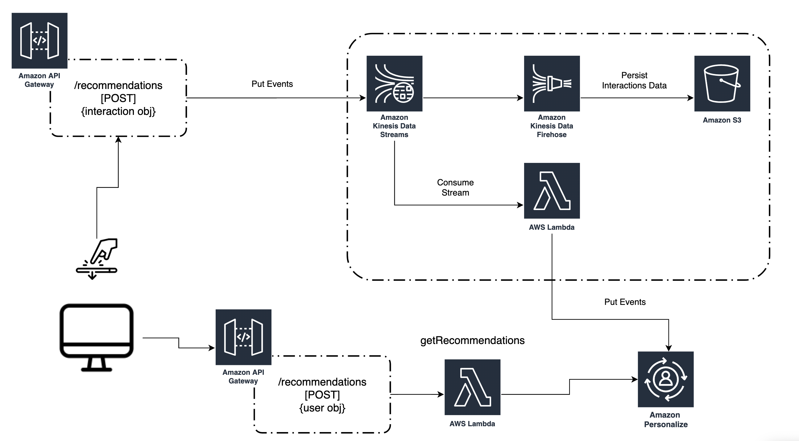

# 入门指南

这个示例展示了一个关键部分，您可以使用它来构建 API 层，以使用 Amazon Personalize 推荐并生成实时事件

正如我们下面所看到的，这是您将从这个项目中部署的架构。



**注意：**您需要在完成本教程之前独立部署 Amazon Personalize 活动和事件跟踪器。您可以使用 MLOps 文件夹下的下述自动化示例部署您的 Amazon Personalize 活动，也可以参考入门指南文件夹。

## 先决条件

### 安装 AWS SAM

AWS Serverless Application Model（SAM）是一个开源架构，用于构建无服务器应用程序。它提供简写语法来表示函数、API、数据库和事件源映射。每个资源仅需使用几行，就可以定义所需的应用程序并使用 YAML 对其建模。部署期间，SAM 会转换 SAM 语法并将该语法扩展为 AWS CloudFormation 语法，让您能够更快构建无服务器应用程序。

**安装** [AWS SAM CLI](https://docs.aws.amazon.com/serverless-application-model/latest/developerguide/serverless-sam-cli-install.html)。
这将安装构建、部署和本地测试项目所需的工具。在本例中，我们将只使用 AWS SAM 进行构建和部署。如需了解更多信息，请参见我们的[文档](https://docs.aws.amazon.com/serverless-application-model/latest/developerguide/what-is-sam.html)。

### 创建您的 Personalize 组件 

根据我们的入门指南[说明](https://github.com/aws-samples/amazon-personalize-samples/tree/master/getting_started)，**创建**一个 Amazon Personalize 活动并附加一个事件跟踪器

您还可以利用 MLOps [示例](https://github.com/aws-samples/amazon-personalize-samples/tree/master/next_steps/operations/ml_ops)自动化这一部分的操作

## 构建和部署

为了部署项目，您需要运行以下命令：

1. 复制 Amazon Personalize 样本存储库
    - `git clone https://github.com/aws-samples/amazon-personalize-samples.git`
2. 导航至 *next_steps/operations/streaming_events* 目录
    - `cd amazon-personalize-samples/next_steps/operations/streaming_events`
3. 构建您的 SAM 项目。[安装说明](https://docs.aws.amazon.com/serverless-application-model/latest/developerguide/serverless-sam-cli-install.html)
    - `sam build`
4. 部署您的项目。SAM 提供了一个引导式部署选项，请注意，您需要提供您的电子邮件地址作为接收通知的参数。
    - `sam deploy --guided`
5. 输入您想存储事件数据、Personalize Campaign ARN 和 EventTracker ID 的 S3 存储桶。

## 测试端点

- 导航至 Amazon CloudFormation [控制台](https://console.aws.amazon.com/cloudformation/home?region=us-east-1)
- 选择由 SAM 部署的堆栈
- 导航至输出部分，您会看到一个 API 密钥的两个端点：
    1. POST getRecommendations 端点
    2. POST 事件端点
    3. 重定向至 API Gateway 控制台，在那里您可以单击 Show Key（显示密钥）部分来显示 API 密钥

如果您使用的是 PostMan 或类似软件，您需要提供一个标题以及：
`x-api-key: <YOUR API KEY VALUE>`

**POST getRecommendations 示例：**

*Body Parameter:*
```
{
    "userId":"12345"
    
}
```

*Endpoint:* `https://XXXXXX.execute-api.us-east-1.amazonaws.com/dev2/recommendations`


**POST 事件示例**

对于 POST 端点，您需要在请求*正文*中发送一个类似如下的事件：

*Endpoint:* `https://XXXXXX.execute-api.us-east-1.amazonaws.com/dev2/history`

*Body:*
```
{
    "Event":{
        "itemId": "ITEMID",
        "eventValue": EVENT-VALUE,
        "CONTEXT": "VALUE" //optional
    },
    "SessionId": "SESSION-ID-IDENTIFIER",
    "EventType": "YOUR-EVENT-TYPE",
    "UserId": "USERID"
}
```

## 总结

现在您的账户中已经有了该架构，您可以通过 API Gateway POST 推荐端点使用 Amazon Personalize 的推荐，并将实时交互数据流式传输至 POST 事件端点。

这个架构还有两个其他特性：

- 包含事件的 S3 存储桶通过 Kinesis Stream 保存。您可以通过使用 Glue 和 Athena 等其他 AWS 服务对该存储桶进行分析。例如，您可以看看这篇关于如何自动化 ETL 流水线的[博客文章](https://aws.amazon.com/blogs/big-data/build-and-automate-a-serverless-data-lake-using-an-aws-glue-trigger-for-the-data-catalog-and-etl-jobs/)。


## 下一步

祝贺您！您已经成功围绕 Amazon Personalize 部署并测试了 API 层。

如需了解更多有关获得推荐的信息，请参见我们的[文档](https://docs.aws.amazon.com/personalize/latest/dg/getting-recommendations.html)。
