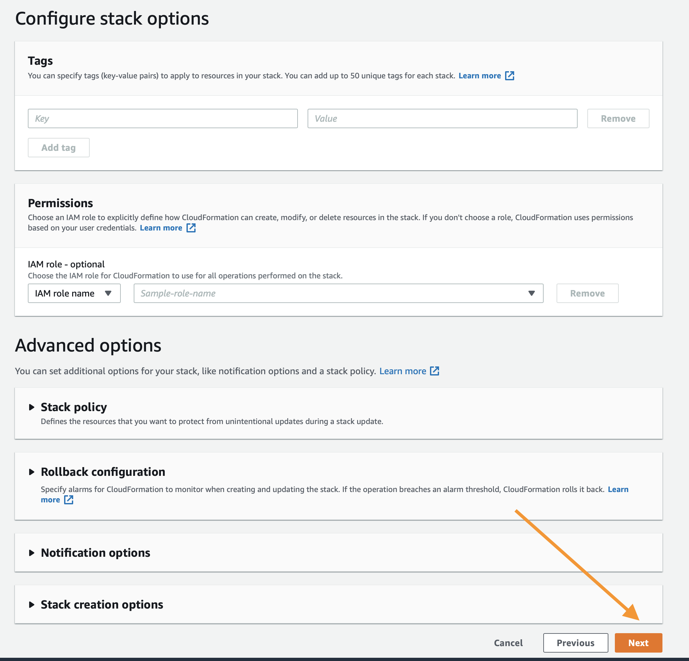

## Amazon Personalize 沉浸日

沉浸日的目标是为学习如何使用 [Amazon Personalize](https://aws.amazon.com/personalize/) 的各种功能提供一个共同的起点。

如需详细了解所提到的任何概念，请查看 [Personalize 开发人员指南](https://docs.aws.amazon.com/personalize/latest/dg/what-is-personalize.html)

通过这些笔记本中的内容，您将学会：

1. 准备一个用于 Amazon Personalize 的数据集。
1. 基于该数据集构建模型。
1. 根据实际观察结果评估模型的性能。

## 日程

下面的步骤概述了构建自己的时间序列预测模型、评估这些模型，然后清理所有资源以防止产生不必要的费用的流程。如需开始，请执行以下步骤。

1. 部署下面的 CloudFormation 模板或使用为您的 IAM 账户安装和配置的 AWS CLI 构建一个本地 Jupyter 环境。
1. [personalize_hrnn_metadata_contextual_example.ipynb](personalize_hrnn_metadata_contextual_example.ipynb) 展示了如何将这些有用的信息上载到我们的系统以帮助生成推荐。需要注意的是，元数据配方的改进取决于可以从提供的元数据中提取多少信息。

## 先决条件 

1. AWS 账户
1. 账户中具有管理权限的用户

## 综述

1. 首先，您将部署一个 CloudFormation 模板，该模板将创建一个用于数据存储的 S3 存储桶、一个执行练习的 SageMaker 笔记本实例、适用于该笔记本实例的 IAM 策略，并且该模板会将这个存储库复制到该笔记本实例中，这样您就可以开始使用了。
1. 接下来，打开 `personalize_hrnn_metadata_contextual_example.ipynb` 开始使用。
1. 这个笔记本将指导您了解其他笔记本的流程，直到您有一个可运作且经过评估的 Amazon Personalize。

## 构建您的环境：

如上所述，第一步是部署一个 CloudFormation 模板，它将为您执行大部分初始设置工作。在新窗口或新标签页中登录您的 AWS 账户。完成之后，在新标签页中打开下面的链接，开始通过 CloudFormation 部署所需项目。

如果您对部署堆栈有任何问题，请按照截图进行操作。

### CloudFormation Wizard

首先点击底部的 `Next`：

在这个页面上您有几个任务：

1. 将堆栈名称更改为相关的名称，如 `PersonalizeImmersionDay`
1. 更改笔记本名称（可选）
1. 修改 SageMaker EBS 存储卷的卷大小，默认为 10GB，如果您的数据集预计会更大，请相应增加卷的大小。

完成后点击底部的 `Next`。

这个页面比较长，所以滚动到底部，点击 `Next`。如果您有自定义需求，所有默认值应该足以完成 POC。

再次滚动到底部，选中复选框，使模板能够创建新的 IAM 资源，然后点击 `Create Stack`。

几分钟后，CloudFormation 会以您的名义创建上述资源，在进行预置时，页面如下所示：

完成后，您会看到下面的绿色文本，表明这项工作已经完成：

现在您的环境已创建，请点击控制台顶部的 `Services` 前往 SageMaker 的服务页面，搜索 `SageMaker`，然后点击该服务。

在 SageMaker 控制台滚动页面，直到看到绿色框，指出现在有许多笔记本正在使用中，然后点击该框。

在这个页面上，您将看到您运行的任何 SageMaker 笔记本的列表，只需点击您创建的 Personalize POC 笔记本上的 `Open JupyterLab` 链接

然后会打开您的 POC Jupyter 环境；如果您不熟悉，可以将它想成是基于 Web 的数据科学 IDE。

在您的左手边，请导航至以下目录 `amazon-personalize-samples/workshops/Immersion_Day/`，并双击 `personalize_hrnn_metadata_contextual_example.ipynb` 笔记本。