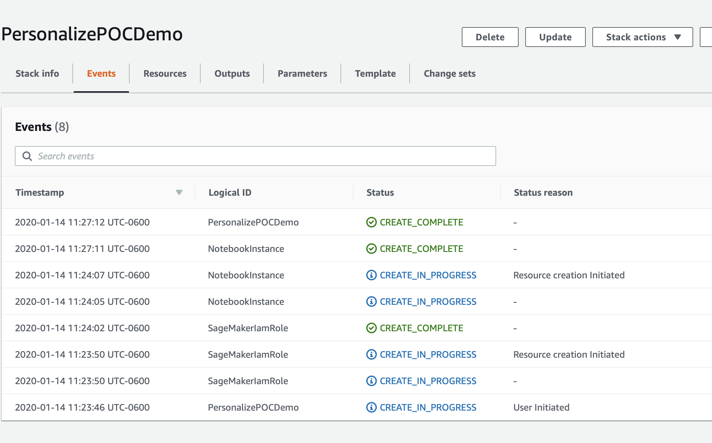

# Personalize POC 指南

Amazon Personalize 是一款机器学习服务，可让您以快速有效的方式构建和扩展推荐/个性化模型。下面的内容旨在帮助您为给定用例构建第一个模型，并假定您的数据可能还没有达到 Amazon Personalize 使用的理想格式。

此存储库假设您基本熟悉该服务，如果您还不熟悉，建议您使用下面的入门材料。

## Amazon Personalize 简介

如果您不熟悉 Amazon Personalize，您可以在以下页面了解更多关于此工具的信息：

* [产品页面](https://aws.amazon.com/personalize/)
* [GitHub 示例笔记本](https://github.com/aws-samples/amazon-personalize-samples)
* [产品文件](https://docs.aws.amazon.com/personalize/latest/dg/what-is-personalize.html)

## 目标 

此次 POC 结束时，您应该已经掌握了以下技能：

1. 如何将数据集映射至 Amazon Personalize。
1. 哪些模型或配方适合哪些用例。
1. 如何以程序化方式构建模型。
1. 解释模型指标。
1. 以程序化方式部署模型。
1. 从 Personalize 中获取结果。

## 已完成示例

使用之前，笔记本上所有输出均已删除，但如果您想查看该流程的完整示例，可参见 `completed` 文件夹中的笔记本。

## 流程：

1. 部署您的工作环境 [参见下文]
1. 验证和导入用户项目交互数据 –
`01_Validating_and_Importing_User_Item_Interaction_Data.ipynb`
1. 验证和导入项目元数据 –
`02_Validating_and_Importing_Item_Metadata.ipynb`
1. 创建和评估您的首个解决方案 –
`03_Creating_and_Evaluating_Solutions.ipynb`
1. 部署活动和筛选器 –
`04_Deploying_Campaigns_and_Filters.ipynb`
1. 部署活动和筛选器 –
`05_Interacting_with_Campaigns_and_Filters.ipynb`
1. 清理 AWS 账户上的资源 – `06_Clean_Up_Resources.ipynb`

这就是该流程的常规顺序，但是，如果您将流程作为为期 2 天的辅助性现场 POC 来操作，建议您至少在抵达现场前导入用户项目交互数据和项目元数据。

## 部署您的工作环境

如上所述，第一步是部署一个 CloudFormation 模板，它将为您执行大部分初始设置工作。在新窗口或新标签页中登录您的 AWS 账户。完成之后，在新标签页中打开下面的链接，开始通过 CloudFormation 部署所需项目。

如果您对部署堆栈有任何问题，请按照截图进行操作。

### CloudFormation Wizard

首先点击底部的 `Next`：

在这个页面上您有几个任务：

1. 将堆栈名称更改为相关的名称，如 `PersonalizePOC`
1. 更改笔记本名称（可选）
1. 修改 SageMaker EBS 存储卷的卷大小，默认为 10GB，如果您的数据集预计会更大，请相应增加卷的大小。

完成后点击底部的 `Next`。

这个页面比较长，所以滚动到底部，点击 `Next`。如果您有自定义需求，所有默认值应该足以完成 POC。

再次滚动到底部，选中复选框，使模板能够创建新的 IAM 资源，然后点击 `Create Stack`。

几分钟后，CloudFormation 会以您的名义创建上述资源，在进行预置时，页面如下所示：

完成后，您会看到下面的绿色文本，表明这项工作已经完成：

现在您的环境已创建，请点击控制台顶部的 `Services` 前往 SageMaker 的服务页面，搜索 `SageMaker`，然后点击该服务。

在 SageMaker 控制台滚动页面，直到看到绿色框，指出现在有许多笔记本正在使用中，然后点击该框。

在这个页面上，您将看到您运行的任何 SageMaker 笔记本的列表，只需点击您创建的 Personalize POC 笔记本上的 `Open JupyterLab` 链接

然后会打开您的 POC Jupyter 环境；如果您不熟悉，可以将它想成是基于 Web 的数据科学 IDE。该环境应该会自动为您打开 `PersonalizePOC` 文件夹，若没有，只需点击浏览器屏幕左侧的文件夹图标，并按照下面文档中的说明，即可开始您的 POC 流程！

## 验证和导入用户项目交互数据

Amazon Personalize 支持的每一种算法的核心数据均为用户项目交互数据；这个笔记本将指导您识别此类数据，然后针对服务对数据进行格式化、定义数据架构，最后导入数据。

打开 `01_Validating_and_Importing_User_Item_Interaction_Data.ipynb`，并按照指示操作。

完成此操作后，接下来可以开始导入元数据。

## 验证和导入项目元数据 

Amazon Personalize 有几种算法可以在没有元数据的情况下提供结果。但是，根据您的数据集，用户个性化和 HRNN 元数据算法可能是一个有趣的部署资源。

打开 `02_Validating_and_Importing_Item_Metadata.ipynb`，并按照指示操作。

完成该操作后，您可以继续创建并评估您的首个解决方案。

这与用户流程类似，并且支持这两种数据类型的算法只有用户个性化和 HRNN-Metadata 算法。

## 创建和评估您的首个解决方案

在 Amazon Personalize 中有一个解决方案的概念，它是一个基于您提供给服务的数据的训练模型。所有模型都是私有的，账户之间甚至数据集组之间都不存在数据共享。本笔记本将指导您了解训练模型的流程；即构建一个解决方案，用于：

* HRNN
* SIMS
* Personalized-Ranking

您可能会注意到，这些算法或配方解决的问题截然不同。目的旨在向您展示如何从一个相对简单的数据集构建能处理大量问题的解决方案。

打开 `03_Creating_and_Evaluating_Solutions.ipynb`，然后按照指示构建解决方案，并查看结果。

### 部署您的活动和筛选器

当您拥有了一系列经过训练的解决方案后，下一步就是部署它们。这一步在内部完成 `04_Deploying_Campaigns_and_Filters.ipynb`

在这里，您将学习：
1. 部署与容量规划
1. 如何创建项目和事件筛选器

### 与 Personalize 交互。

当您拥有了一系列经过训练的解决方案后，下一步就是部署它们。这一步在 `05_Interacting_with_Campaigns_and_Filters.ipynb` 内部完成。在这里，您将学习：

1. 如何与已部署解决方案交互（多种方法）
1. 实时交互
1. 在活动中使用筛选器
1. 批量导出

### 下一步

根据这些笔记本上的指导进行操作，应该可以帮助您为客户创建一系列工作模型。您会从这里看到客户今天如何根据他们的目标（转化量、点击量等）完成 AB 测试，然后开始向这些模型发送流量并监控这些指标。随着时间的推移，这应该会帮助您建立信心，并实现规模化生产。

更多关于 AB 测试的内容即将发布，敬请期待。

### 清理

完成 POC？ 如果您想在遵循这些笔记本的指导的同时删除 AWS 账户中创建的所有资源，请参见 `06_Clean_Up_Resources.ipynb` 笔记本。它将帮助您识别部署在您账户的所有 Personalize 资源，并向您展示如何删除这些资源。