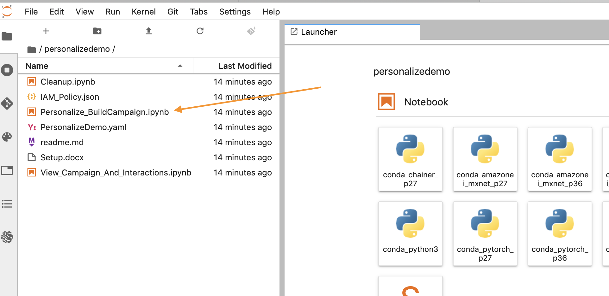

# 入门指南

下面的教程将引导您构建一个环境，通过 Amazon Personalize 创建自定义数据集、模型和推荐活动。如果您对存储库中的以下任何内容有任何问题，请在此处提出您的问题。

## 先决条件

仅当您使用 CloudFormation 模板部署时适用，否则请咨询特定任务所需的 IAM 权限。

1. AWS 账户
2. 拥有 AWS 账户管理员权限的用户

## re:invent 2019

如果您正在为 re:Invent 2019 构建该研讨会，只需点击下面的 Launch Stack（启动堆栈）按钮。运行您的 Jupyter 笔记本实例，打开“getting_started”文件夹以及 `ReInvent2019_Workshop.ipynb`！

如果您对这些步骤有任何问题，请按照截图进行操作。

### CloudFormation Wizard

首先点击底部的 `Next`，如图所示：

在下一个页面中，您需要提供一个唯一的 S3 存储桶名称，用于您的文件存储，推荐将您的姓和名添加到默认选项的末尾，如下所示，更新之后再次点击 `Next`。

这个页面比较长，所以滚动到底部，点击 `Next`。

再次滚动到底部，选中复选框，使模板能够创建新的 IAM 资源，然后点击 `Create Stack`。

几分钟后，CloudFormation 会以您的名义创建上述资源，在进行预置时，页面如下所示：

完成后，您会看到下面的绿色文本，表明这项工作已经完成：

## 日程

以下步骤主要介绍了构建自己的推荐模型并进行改进，然后清理所有资源以防止产生不必要的费用的流程。如需开始执行这些操作，请遵循下一节中的步骤。

1. `ReInvent2019_Workshop.ipynb`  – 引导您构建您的第一个活动和推荐算法。

## 利用笔记本

首先点击 AWS 控制台顶部导航栏中的 `Services` 链接，导航至 SageMaker 服务页面。

在搜索字段输入 `SageMaker`，然后在服务显示时点击，在服务页面最左边菜单栏中点击 `Notebook Instances` 链接。

如需前往 Jupyter 界面，只需点击笔记本实例旁最右边的 `Open JupyterLab`。

点击打开的链接后，需要几秒钟时间将您重定向到 Jupyter 系统，但进入该系统后，您应该会看到左手边有一个文件集合。点击 `1.Building_Your_First_Campaign.ipynb` 开始。

实验的其余部分将通过 Jupyter 笔记本进行，只需在执行前读取每个块并进入下一个块。如果您有任何关于如何使用笔记本的问题，请询问您的导师，或者如果您独立操作，这里有一个很好的入门视频：

https://www.youtube.com/watch?v=Gzun8PpyBCo

## 笔记本工作完成后

完成了笔记本上的所有工作以及清理步骤后，最后要做的就是删除您用 CloudFormation 创建的堆栈。为此，在 AWS 控制台中再次点击顶部 `Services` 链接，这次进入 `CloudFormation` 并点击链接。

点击您创建的演示堆栈上的 `Delete` 按钮：

最后点击弹出窗口中的 `Delete Stack` 按钮：

现在您会注意到正在删除堆栈。看到 `Delete Completed`，即说明所有的东西已经全部删除，并且您已经 100% 完成了这个实验。

