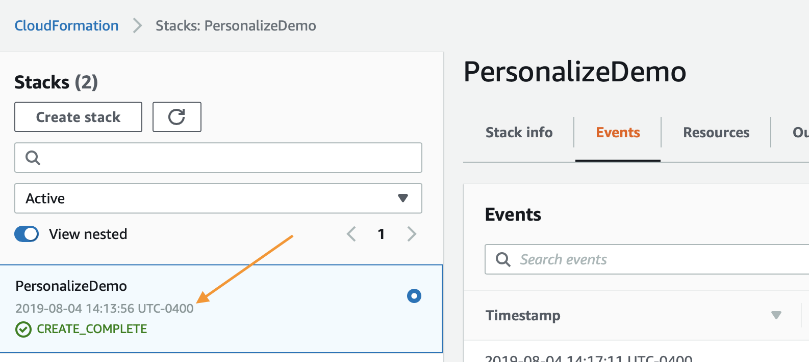

# 构建您自己的电影推荐器
本教程将指导您构建自己的电影推荐器。
您将看到如何在 Amazon Personalize 中创建资源来生成推荐，就像 Magic Movie Machine 一样！

## 教程概述
完成本教程涉及以下步骤：

1. 按照这个文件中的说明来构建您的环境，并在 AWS Sagemaker 中找到笔记本。这涉及部署一个 AWS CloudFormation 堆栈，用于设置您的笔记本环境。
2. 运行 AWS Sagemaker 上的 `Building_the_Magic_Movie_Machine_Recommender.ipynb` 笔记本。您已在第一步中部署该笔记本。这个笔记本将引导您建立您的第一个电影推荐器并获得第一个推荐。
3. 运行 `Clean_Up_Resources.ipynb`。这个笔记本会删除在前一个笔记本中创建的任何内容，这样就无需为额外资源付费。
4. 删除 AWS CloudFormation 堆栈，以删除您在第二步中创建的环境资源。

*注意*：您可以在 GitHub 中直接探索该笔记本的内容。但要想成功运行该笔记本，您必须按照以下步骤在预配置的环境中部署该笔记本。

## 构建您的环境 
在打造您自己的电影推荐器之前，您必须创建如下工作环境：

1. 确保您已满足下面列出的环境先决条件。
2. 部署 AWS CloudFormation 堆栈。
3. 导航至 Amazon SageMaker 控制台

### 环境先决条件

如需用 CloudFormation 模板部署，您必须具备：

1. AWS 账户
2. 拥有 AWS 账户管理员权限的用户

### 部署环境

第一步是部署一个 CloudFormation 模板，它将为您执行大部分初始设置。在另一个浏览器窗口登录您的 AWS 账户。完成之后，在新标签页中打开下面的链接，开始通过 CloudFormation 部署所需项目。

如果您对这些步骤有任何问题，请按照以下截图进行操作。

  
点击展开说明

  
### 点击底部的 `Next`（下一步）使用 AWS CloudFormation Wizard

Start，如图所示：

在下一个页面中，您需要提供一个唯一的 S3 存储桶名称，用于您的文件存储，推荐将您的姓和名添加到默认选项的末尾，如下所示，更新之后再次点击 `Next`（下一步）。

这个页面有点长，所以滚动到底部，点击 `Next`（下一步）。

再次滚动到底部，选中复选框，允许模板创建新的 IAM 资源，然后点击 `Create Stack`（创建堆栈）。

几分钟后，CloudFormation 会以您的名义创建上述资源，在进行预置时，页面如下所示：

完成后，您会看到下面的绿色文本，表明这项工作已经完成：

现在您已经创建了环境，您需要保存 S3 存储桶的名称以备将来使用，您可以点击 `Outputs`（输出）选项卡，然后查找资源`S3Bucket`，找到后，暂时复制并粘贴到一个文本文件。

### 利用笔记本

首先导航到 Amazon SageMaker 登录[页面](https://console.aws.amazon.com/sagemaker/home)。从服务页面点击最左边菜单栏上的 `Notebook Instances` 链接。

如需前往 Jupyter 界面，只需点击笔记本实例旁最右边的 `Open JupyterLab`。

点击打开的链接后，需要几秒钟时间将您重定向到 Jupyter 系统，但进入该系统后，您应该会看到左手边有一个文件集合。

首先，导航至 next_steps 文件夹 > workshops（研讨会）> magic_movie_machine > notebooks（笔记本）> Building the Magic Movie Machine Recommender.pynb（构建 Magic Movie Machine Recommender.pynb）

`amazon-personalize-samples/next_steps/workshops/magic_movie_machine/notebooks/Building the Magic Movie Machine Recommender.ipynb`

确保在运行实验室之前选择使用 Python 3.x 的内核（内核名以 p3x 结尾）。实验的其余部分将通过 Jupyter 笔记本进行，只需在执行前读取每个块并进入下一个块。如果您有任何关于如何使用笔记本的问题，这里有一个很好的入门视频：

https://www.youtube.com/watch?v=Gzun8PpyBCo

## 删除环境资源

完成了笔记本上的所有工作以及清理步骤后，最后要做的就是删除您用 CloudFormation 创建的堆栈。为此，在 AWS 控制台中再次点击顶部 `Services` 链接，这次进入 `CloudFormation` 并点击链接。

点击您创建的演示堆栈上的 `Delete` 按钮：

最后点击弹出窗口中的 `Delete Stack` 按钮：

现在您会注意到正在删除堆栈。看到 `Delete Completed`，即说明所有的东西已经全部删除，并且您已经 100% 完成了这个实验。

